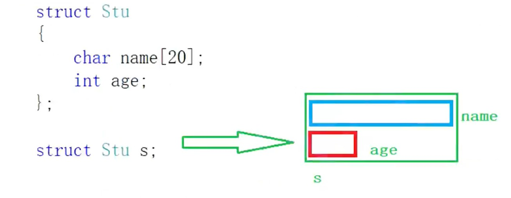
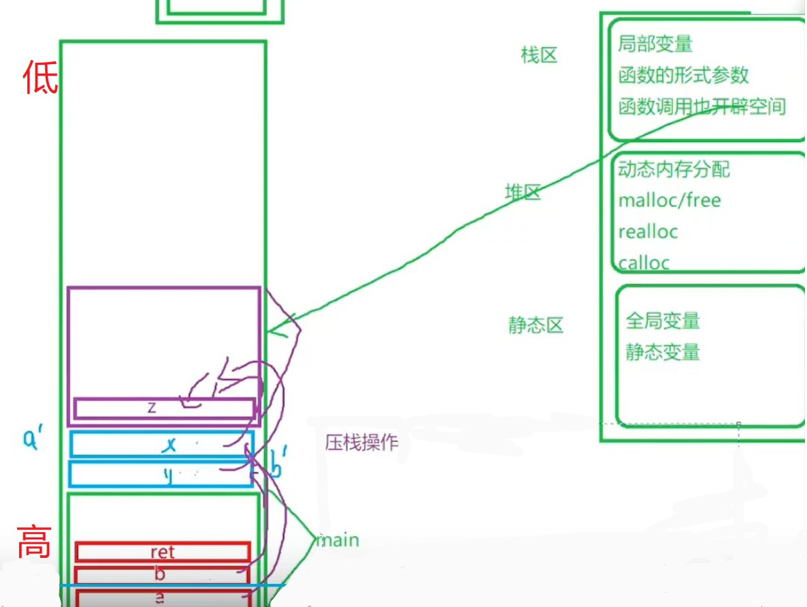
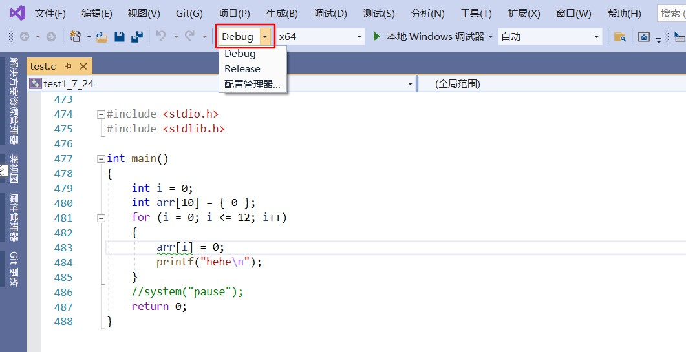
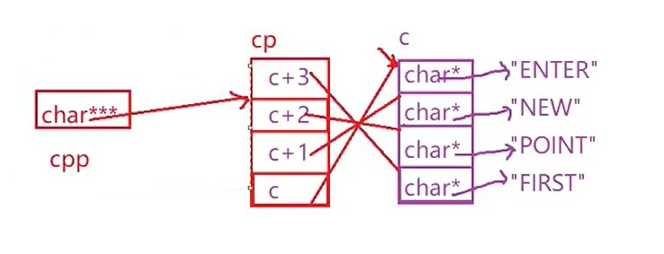

# **第一章** 初识C语言


## 1.1 语言的发展：

​							【二进制语言】    

​								硬件 -- 电：正电、负电

​															1           0

​								101010000101000111001      --  手册           ------>      低级语言

​								101010  -- ADD  -- 助记符    --   【汇编语言】

​								【B语言】 

​								【C语言】、【C++】 …… 高级语言         ------->      高级语言

​									

## 1.2 C 语言国际标准

国际标准 -->   ANSI  C  -  C89 - > C90 -> C98

C99 / C11  并不流行 -- 不少编译器不支持

## 1.3 第一个C 程序

```c
// 包含一个叫stdio.h的文件
// std - 标准 standard input output
// 
#include <stdio.h>
// int 整型的意思
// main 前面的int表示 main函数调用返回一个整型值。
int main()   // 主函数 - 程序入口，main函数有且仅有一个
{	
    // 函数 - print function  -- printf - 打印函数
    // 库函数 - C语言本身提供给我们使用的函数
    // 别人的东西 - 打招呼
	printf("hehe\n");
	return 0;   // 返回 0
}


// 过时写法
// void main()
// {}
```

## 1.4 数据类型

+ 内置类型 -- int，float ……
+ 自定义类型 -- 结构体，枚举，共用体。

计算字符类型==所占字节数==  ：`sizeof()`  -- **是操作符/运算符，不是函数。**

C 语言标准规定：

+ `sizeof(long)` >= `sizeof(int)`
  + ==Win==   X86和X64都为 4。
  + ==Linux==  X86为4，X64为8。

计算机中的单位：

+ bit
+ 1 byte  = 8bit；     
+ 1 kb  = 2^10^byte；
+ mb
+ gb 
+ tb
+ pb

| char                         | 字符型       | 1 byte |
| :--------------------------- | ------------ | ------ |
| short [int]                  | 短整型       | 2      |
| int                          | 整型         | 4      |
| long [int]                   | 长整型       | 4/8    |
| long long [int]（C99中提出） | 更长的整型   | 8      |
| float                        | 单精度浮点数 | 4      |
| double                       | 双精度浮点数 | 8      |

| 字符格式 | 意义                |
| -------- | ------------------- |
| %c       | 字符型              |
| %d       | 整型 （十进制数据） |
| %u       | 打印无符号整型      |
| %x       | 打印16进制数字      |
| %f       | 浮点型 - - 小数     |
| %lf      | 双精度浮点数        |
| %p       | 以地址的形式打印    |

```c
#include <stdio.h>
int main()
{
    char arr[5] = {0};
    scanf("%s")
    return 0;
}
```

**注：**

输入的字符个数应比 ==数组长度小1== 。因为，输入格式为字符串，编译器会在字符串末尾自动加`'\0'`。若输入的字符个数与数组长度相等，会报数组越界的错误。

## 1.5 常量、变量

指定数据类型为 ==单精度==且 ==小数部分不为0==时，要加上后缀f。`float weight = 94.3f;`，否则会有警告（直接写出来的浮点数默认是double类型）。

## 1.6 局部变量、全局变量

1. 局部变量的作用域是变量的局部范围   -- 不初始化 -- 默认为随机值（直接用`printf`函数输出未初始化的变量值，会报错）；

2. 全局变量的作用域是整个工程  --  不初始化，默认是 0 。

3. 变量前加`static`，不初始化，默认值也是0；

   ```c
   #include <stdio.h>
   int i;
   int main()
   {
   	int j;
   	printf("%d\n", i); // 0
   	// printf("%d\n", j); // 报错
   	return 0;
   }
   ```


在一个项目的不同源文件中的代码，可以相互使用，但是得加`extern`。

```c
// num.c 中代码
#include <stdio.h>

int g_val = 111;
```

```c
// test.c中代码
#include <stdio.h>

int main() 
{
    extern int g_val;
    printf("%d", g_val);  // 111 
    
    return 0;   // 返回 0
}
```

## 1.7 常量

**C语言中的常量分为以下几种：**

+ 字面常量
+ `const`修饰的常变量
+ `#define`定义的标识符常量
+ 枚举常量

```c
#include <stdio.h>

// 3. #define 定义的标识符常量
#define MAX 10   // define 属于预处理指令，不属于关键字

// 4. 枚举常量   --- 有值且不可被改变
// 枚举 ： 一一列举
// 性别 ： 男、女、保密
// 三原色：红、黄、蓝

enum Sex
{
    MALE,
    FEMALE,
    SECRET
};
// MALE,FEMALE.SECRET -- 枚举常量
int main()
{
    // 1. 字面常量
    // 3;
    // 3.14;

    // 2. const - 常属性 -- 不能被修改的属性。
    // const 修饰的常变量
    const int num = 4;
    printf("%d\n", num); // 4
    // num = 8;  // 报错
    printf("%d\n", num); 

    const int n = 10; // n是变量，但是又有常属性，所以我们说n是常变量
    // int arr[n] = { 0 }; // 报错 -- 在C99标准之前，数组的大小只能是常量，VS2019对C99支持的不是很好，不支持变长数组，所以这里报错了。

	// MAX = 200; // error -- 不能修改
    int arr[MAX] = { 0 };
    printf("%d\n", MAX); // 10

    enum Sex s = FEMALE; // 定义枚举类型变量
    s = MALE; // 枚举类型定义出来的变量可以改变；
    // MALE = 6; // 枚举常量不可被改变。
    printf("%d\n", MALE);// 0
    printf("%d\n", FEMALE);// 1
    printf("%d\n", SECRET);// 2

    return 0;
}
```

##  1.8 字符串 + 转义字符 + 注释

**C语言 没有字符串类型。**

### 1.8.1 字符串

`"hello bit.\n"`

> 双引号（Double Quo）引起来的一串字符称为 **字符串字面值** （String Literal），或者简称 **字符串**。

  **注：**

​			字符串的结束标志是一个 `\0`的转义字符。在计算字符串长度的时候 `\0` 是结束标志，不算做字符串内容。

```c
#include <stdio.h>
#include <string.h>
int main()
{
    // 数据在计算机上存储的时候，存储的是2进制
    // ASCII 编码    ASCII 码值
    //    A             65
    //    a             97
    //    \0            0
    char arr1[] = "abc"; 
    // "abc" --- 'a' 'b' 'c' '\0' --> 字符串末尾隐藏一个'\0' ---> '\0'字符串结束标志
    char arr2[] = { 'a','b','c'};
    char arr3[] = { 'a','b','c','\0'}; // '\0'的值为0，所以这里最后一个字符写'\0'或0都可以

    printf("%s\n", arr1); // abc
    printf("%s\n", arr2); // abc烫烫烫烫蘟bc
    // 打印完 'a' 'b' 'c' 之后不会结束，会接着打印随机值。
    printf("%s\n", arr3); // abc

    // strlen -- strlen length -- 计算字符串长度(不将'\0'算在内)
    printf("%d\n",strlen(arr1)); // 3
    printf("%d\n",strlen(arr2)); // 随机值 （a b c x x x x x）
    printf("%d\n",strlen(arr3)); // 3
    
    printf("%s\n", "abc0def"); // abc0def
	printf("%s\n", "abc\0def"); // abc
    return 0;
}
```


### 1.8.2 转义字符

```c
#include <stdio.h>
int main()
{
    printf("c:\test\32\test.c"); // c:      est    est.c
    printf("c:\\test\\32\\test.c"); // c:\test\32\test.c
    return 0;
}
```

`??` + `)` --> **三字母词**


```c
int main()
{
    printf("(are you ok\??)\n"); // 输出 (are you ok??)
    return 0;
}
```

| 转义字符 | 释义                                                 |
| -------- | ---------------------------------------------------- |
| `\?`     | 在书写连续多个问号时使用，防止他们被解析成三字母词。 |
| `\'`     | 用于表示字符常量'。                                  |
| `\"`     | 用于表示一个字符串内部的双引号。                     |
| `\\`     | 用于表示一个反斜杠，防止它被解释为一个转义序列符。   |
| `\a`     | 警告字符，蜂鸣                                       |
| `\b`     | 退格符                                               |
| `\f`     | 进纸符                                               |
| `\n`     | 换行                                                 |
| `\r`     | 回车                                                 |
| `\t`     | 水平制表符                                           |
| `\v`     | 垂直制表符                                           |
| `\ddd`   | ddd表示1~3个八进制的数字。 如： \130 X               |
| `\xdd`   | dd表示2个十六进制数字。 如： \x30 0                  |


```c
#include <stdio.h>
#include <string.h>
int main()
{
    printf("%s\n", "dsf\091"); // dsf
    printf("%d\n",strlen("c:\test\32\test.c")); // 13
    printf("%d\n",strlen("c:\test\328\test.c")); // 14 
    // \328 会被看作2个字符 \32 和 8;
    return 0;
}
```

### 1.8.3 注释

1. **C语言注释风格** ： `/*  */`  -- 不支持嵌套的（不太好）。
2. **C++注释风格**： `// ` 
3. **快捷键**： 
   + `ctrl + k + c`   或     `ctrl + shift + /`: 进行注释；
   + `ctrl + k + u`: 取消注释；

## 1.9 常见关键字

+ 关键字不能自己创建。
+ 变量名不能是关键字。

```c
auto（自动）  break   case  char  const   continue  default  do   double else  enum   
extern（声明/引入外部符号） float  for   goto  if   int   long  register（寄存器关键字）    return   short  signed（有符号数）
sizeof   static struct  switch  typedef(类型定义（或类型重命名）) union（联合体 / 共用体）  unsigned   void  volatile(Linux系统部分)  while
```

```c
int main()
{
    auto int a = 10; // 局部变量 -- 自动变量（基本不写，省略）
    register int b = 10; // 建议 将b定义成寄存器变量
    // int 定义的变量是有符号的
    // signed int c;  (signed 一般省略不写)
    return 0;
}
```

**计算机存储数据：** 速度：   寄存器 > 高速缓存 > 内存 > 硬盘

### typedef 关键字

> `typedef`类型定义，可以理解为类型重命名。

```c
#include <stdio.h>
int main()
{
    // typedef —— 类型定义 —— 类型重命名
    typedef unsigned int u_int;
    unsigned int num = 20;
    return 0;
}
```

### 关键字 static

> 在C语言中：
>
> `static` 是用来修饰变量和函数的
>
> 1. 修饰局部变量  -- 静态局部变量
> 2. 修饰全局变量  -- 静态全局变量
> 3. 修饰函数          -- 静态函数

**1. 修饰局部变量：**

```c
//代码1
#include <stdio.h>
void test()
{
	int a = 0;
	a++;
	printf("%d ", a);
}
int main()
{
	int i = 0;
	for (i = 0; i < 5; i++)
	{
		test();
	}
	return 0;
}


// 运行结果 >:  1 1 1 1 1

//代码2
#include <stdio.h>
void test()
{
	//static修饰局部变量
	static int a = 0;
	a++;
	printf("%d ", a);
}
int main()
{
	int i = 0;
	for (i = 0; i < 5; i++)
	{
		test();
	}
	return 0;
}


// 运行结果 >: 1 2 3 4 5
```

**结论**：

`static `修饰局部变量改变了变量的生命周期，让静态局部变量出了作用域仍然存在，到程序结束，生命周期才结束。

**2. 修饰全局变量**

```c
//代码1
//add.c
int g_val = 2018;

//test.c
// 声明外部变量
extern g_val;
int main()
{
    printf("%d\n", g_val);
    return 0; 
}
// 可以正常运行


//代码2
//add.c
static int g_val = 2018;

//test.c
// 声明外部变量
extern g_val;
int main()
{
    printf("%d\n", g_val);
    return 0; 
}
// 编译时会报连接性错误
```

**结论：**

全局变量本身是具有外部链接属性的，但是一个全局变量被`static`修饰，使得这个全局变量失去外部链接属性，只能在==本源文件内使用==，不能在其他源文件内使用。

**3. 修饰函数**

```c
//代码1
//add.c
int Add(int x, int y) 
{
    return x+y; 
}

//test.c
// 声明外部符号
// extern 最好加上
extern int Add(int x,int y);
int main()
{
    printf("%d\n", Add(2, 3));
    return 0; 
}
// 可以正常运行


//代码2
//add.c
static int Add(int x, int y) 
{
    return x+y; 
}
//test.c
// 声明外部符号
int Add(int x,int y);
int main()
{
    printf("%d\n", Add(2, 3));
    return 0; 
}
// 编译时会报连接性错误
```

**结论：**

函数默认具有外部链接属性，但是一个函数被`static`修饰，使得函数失去外部链接属性，变成内部链接属性，这个函数只能在本源文件内使用，不能在其他源文件内使用。

`static`修饰函数改变了函数的链接属性。

由外部链接属性  变为 内部连接属性。

## 1.10 #define 定义常量和宏

```c
#include <stdio.h>
// #define #include -- 预处理指令
#define MAX 100
// #define 定义宏
// 函数的实现
int Max(int x, int y)
{
    if (x > y)
        return x;
    else
        return y;
}


// 宏的定义
#define MAX(X, Y) (X>Y?X:Y)
#define ADD(x, y) ((x)+(y))
int main()
{
    int a = 10;
    int b = 20;
    // 函数
    int max = Max(a, b);
    printf("max = %d\n", max);
    // 宏的定义
    max = MAX(a, b);
    // max = ((a)+(b));
    printf("max = %d\n", max);
    return 0;
}
```


# 第二章 分支语句和循环语句

## 2.1 分支语句 （选择结构）

### 2.1.1 if 语句

```c
// 语法结构：
if(表达式)
    语句;

if(表达式)
    语句;
else
    语句;

// 多分支
if(表达式1)
    语句1;
else if(表达式2)
    语句2;
else
    语句3;
```

```c
#include <stdio.h>
//代码1
int main()
{
	int age = 0;
	scanf("%d", &age);
	if (age < 18)
	{
		printf("未成年\n");
	}
}
 

//代码2
#include <stdio.h>
int main()
{
	int age = 0;
	scanf("%d", &age);
	if (age < 18)
	{
		printf("未成年\n");
	}
	else
	{
		printf("成年\n");
	}
}


//代码3
#include <stdio.h>
int main()
{
	int age = 0;
	scanf("%d", &age);
	if (age < 18)
	{
		printf("少年\n");
	}
	else if (age >= 18 && age < 30) // 18<=age<=30  => (18<=age)<=30
	{
		printf("青年\n");
	}
	else if (age >= 30 && age < 50)
	{
		printf("中年\n");
	}
	else if (age >= 50 && age < 80)
	{
		printf("老年\n");
	}
	else
	{
		printf("老不死\n");
	}

}
```

####  悬空else

**《高质量C++编程指南》**

```C
#include <stdio.h>
int main()
{
	int a = 0;
	int b = 2;
	if (a == 1)
		if (b == 2)
			printf("hhe\n");
	else
		printf("haha\n");
	return 0;
}

// 运行结果： 什么都不输出
// else 与离得最近的未匹配的if 进行匹配


// 改正
#include <stdio.h>
int main()
{
	int a = 0;
	int b = 2;
	if (a == 1)  // 判断条件建议写成 1 == a
    {	
        if (b == 2)
			printf("hhe\n");
    }
	else
		printf("haha\n");
	return 0;
}
// 输出 haha
```


### 2.1.2 switch 语句

```c
// 语法格式
switch(整形表达式)
{
case 整型常量表达式;
     语句;
}
```

```c
#include <stdio.h>
int main()
{
	int a;
	printf("请输入一个数，\n");
	scanf("%d", &a);
	switch (a) // 括号内必须是整型表达式
	{
	case 1:  // 必须为 整型 常量 表达式
		printf("星期一\n");
		break;
	case 2:
		printf("星期二\n");
		break;
	case 3:
		printf("星期三\n");
		break;
	case 4:
		printf("星期四\n");
		break;
	case 5:
		printf("星期五\n");
		break;
	case 6:
		printf("星期六\n");
		break;
	case 7:
		printf("星期天\n");
		break;
	}

	return 0;
}
```

```C
// 输入1-5输出的是“weekday”;
// 输入6-7输出“weekend”
#include <stdio.h>
int main()
{
	int a;
	printf("请输入一个数，\n");
	scanf("%d", &a);
	switch (a)
	{
	case 1:
	case 2:
	case 3:
	case 4:
	case 5:
		printf("weekday\n");
		break;
	case 6:
	case 7:
		printf("weekend\n");
		break;
	default:
		printf("输入错误\n");
		break;
	}

	return 0;
}
```


#### default 语句

1. `default`语句可有可无，其作用是处理语句中的非法状况。
2. `defaule`和`case`没有顺序所言，但是一般建议把`default`放到最后。


```c
#include <stdio.h>
int main()
{
	int n = 1;
	int m = 2;
	switch (n)
	{
	case 1:m++;
	case 2:n++;
	case 3:
		switch (n)
		{ // switch 允许嵌套使用
		case 1:n++;
		case 2:
			m++;
			n++;
			break;
		}
	case 4:
		m++;
		break;
	default:
		break;
	}
	printf("m = %d,n = %d\n", m, n);

	return 0;
}
// 运行结果
// m = 5,n = 3
```


## 2.2 循环语句 （循环结构）

### 2.2.1 while 语句

```c
// 语法结构
while(判断条件) // 符合判断条件。就执行语句体。
{
	语句体;
}
```

```C
// 代码1
#include <stdio.h>
int main()
{
	int i = 1;
	while (i <= 10)
	{
		if (5 == i)
			break;
		printf("%d ", i);
		i++;
	}

	return 0;
}
// 运行结果： 1 2 3 4


// 代码2
#include <stdio.h>
int main()
{
	int i = 1;
	while (i <= 10)
	{
		if (5 == i)
			continue;
		printf("%d ", i);
		i++;
	}

	return 0;
}
// 运行结果： 1 2 3 4 之后光标闪着不动，程序进入死循环。

// 修改后的代码2
#include <stdio.h>
int main()
{
	int i = 0;
	while (i <= 10)
	{
		i++;
		if (5 == i)
			continue;
		printf("%d ", i);

	}

	return 0;
}
// 运行结果: 1 2 3 4 6 7 8 9 10 11
```

+ `break`**作用**：终止所有循环。
+ `continue`**作用**：终止本次循环后面的语句，直接进入到下次循环。

```c
#include <stdio.h>
int main()
{
    int ch = getchar();
    putchar(ch);
    return 0;
}
```

```c
#include <stdio.h>
int main()
{
 	int ch = 0;
 	// EOF -- end of file --文件结束标志
	 while ((ch = getchar()) != EOF) // 输入EOF 循环并不会结束，而是执行三次循环，读取三次，输出EOF，只有按ctrl+z才能终止循环。
       	putchar(ch);
    return 0; 
}
```


```c
// 改正后代码
#include <stdio.h>
int main()
{
    int ch = 0;
    int ret = 0;
    char pass[20] = { 0 };
    printf("请输入密码:>");
    scanf("%s", pass);
    while(ch=getchar() != '\n')
    {
        ;
    }
    printf("请确认（Y/N）:>");
    ret = getchar();
    if ('Y' == ret)
        printf("确认正确\n");
    else
        printf("确认失败\n");

    return 0;
}
```


### 2.2.2 for 语句

```c
// 语法格式
for(表达式1;表达式2;表达式3)
    循环语句;
```

+ **表达式1**：为 **初始化部分**，用于初始化循环变量；**表达式2**：为 **条件判断部分**，用于判断循环时候终止；**表达式3**：为 **调整部分**，用于循环条件的调整。

+ 建议`for`语句的循环控制变量的取值采用 =="前闭后开区间"==的写法

```c
#include <stdio.h>
int main()
{
    int arr[10] = { 1,2,3,4,5,6,7,8,9,10 };
    int i = 0;
    // 10次循环
    // 10次打印
    // 10个元素
    for (i = 0; i<10; i++) {
        printf("%d ", arr[i]);
    }

    return 0;
}
```

```c
// C 语言语法
int main()
{
    int i = 0;
    for(i = 0;i<=12;i++)
    {
        printf("hehe\n");
    }
}

// C++ 语法
int main()
{
    for(int i = 0;i<=12;i++)
    {
        printf("hehe\n");
    }
}
```


#### for 循环的一些变种

```c
#include <stdio.h>
int main()
{
 //变种1
 for(;;) // 死循环
 {
 printf("hehe\n");
 }
 //1.  for循环的初始化、调整、判断，都可以被省略，
 	// 但是:
 	// for 循环的判断部分如果被省略，那判断条件就是:恒为真
// 2.  不要随便省略相应的代码    
    
 //变种2
#include <stdio.h>
int main()
{
 int x, y;
    for (x = 0, y = 0; x<2 && y<5; ++x, y++)
   {
        printf("hehe\n");
   }
 return 0; 
}
// 运行结果
// hehe
// hehe    
```

#### 一道笔试题

**请问循环要循环多少次**

```c
#include <stdio.h>
int main()
{
    int i = 0;
    int k = 0;
    for (i = 0, k = 0; k = 0; i++, k++)
        k++;
    return 0;
}

// 循环执行0次，因为判断表达式中 k = 0 ,0为假，所以循环执行0次。
```

### 2.2.3 do … while 语句

```c
// 语法格式
do
    循环语句;
while(表达式);
```

```c
#include <stdio.h>
int main()
{
    int i = 1;
    do
    {
        if (5 == i)
            continue;
        printf("%d ", i);
        i++;
    } while (i < 10);
    return 0;
}
// 运行结果: 1 2 3 4 闪光标
// do while 和 while 较相似
```

### 2.2.4 练习

> 计算 n 的阶乘。

```c
#include <stdio.h>
int main()
{
    int i = 0;
    int n = 0;
    int sum = 1;
    printf("请输入一个数，将输出这个数的阶乘\n");
    scanf("%d", &n);
    for (i = 1; i <= n; i++)
        sum *= i;
    printf("%d的阶乘为:>%d", n, sum);
    
    return 0;
}
```

> 计算 1!+2!+3!+……+10!

```C
// 方法一
#include <stdio.h>
int main()
{
    int i = 0;
    int j = 0;
    int n = 0;
    int sum = 0;
    for (n = 1; n <= 10; n++)
    {
        j = 1;
        for (i = 1; i <= n; i++)
            j *= i;   
        printf("%d的阶乘为:>%d\n", n, j);
        
        sum += j;
    }
    printf("1!+2!+3!+……+10!的和为%d",sum);
    
    return 0;
}


// 方法二
#include <stdio.h>
int main()
{
    int i = 0;
    int j = 1;
    int n = 0;
    int sum = 0;
    for (n = 1; n <= 10; n++)
    {
        j *= n;   
        sum += j;
    }
    printf("1!+2!+3!+……+10!的和为%d",sum);
    
    return 0;
}
```

> 在一个有序数组中查找具体的某个数字n。 
>
> 编写int binsearch(int x, int v[], int n); 
>
> 功能：在v[0]<=v[1]<=v[2]<= ….<=v[n-1]的数组中查找x。

```c
// 方法一  -- O(n)
#include <stdio.h>
int main()
{
    int arr[] = { 1,2,3,4,5,6,7,8,9,10 };
    int k = 17;
    int i = 0;
    int sz = sizeof(arr) / sizeof(arr[0]);
    for (i = 0; i < sz; i++)
    {
        if (k == arr[i])
        {
            printf("找到了，下标为:%d\n", i);
            break;
        }
    }
    if (i == sz)
        printf("找不到\n");
    
    return 0;
}


// 方法二  -- O(log~2~^n^)
// 折半查找、二分查找算法
#include <stdio.h>
int main()
{
    int arr[] = { 1,2,3,4,5,6,7,8,9,10 };
    int k = 7;

    int sz = sizeof(arr) / sizeof(arr[0]);  // 计算元素个数
    int left = 0; // 左下标
    int right = sz - 1; // 右下标


    while(left <= right)// 即使是left == right 也有一个元素要查找
    {
        int mid = (left + right) / 2; // 中间元素下标
        if (arr[mid] > k)
        {
            right = mid - 1;
        }
        else if (arr[mid] < k)
        {
            left = mid + 1;
        }
        else
        {
            printf("找到了,下标为:%d\n", mid);
            break;
        }
    }
    if (left > right)
        printf("找不到\n");
    return 0;
}
```

> 编写代码，演示多个字符从两端移动，向中间汇聚。

```c
#include <stdio.h>
#include <string.h>
#include <windows.h>  // 调用sleep函数
#include <stdlib.h>  // 调用清屏函数
int main()
{
    char arr1[] = "welcome to bit!!!!!!";
    char arr2[] = "####################";
    int left = 0;
    // char arr[] = "abc";
    // [a b c \0]
    //  0 1 2  3
    // 表示下标时应该 4-2  -- sizeof(arr)/sizeof(arr[0])-2
    // int right = sizeof(arr1)/sizeof(arr1[0])-2;
    int right = strlen(arr1) - 1;
    while (left <= right)
    {
        arr2[left] = arr1[left];
        arr2[right] = arr1[right];
        printf("%s\n", arr2);
        // 休息1秒 -- 1000毫秒
        Sleep(1000);
        system("cls"); // 执行系统命令的一个函数 - cls - 清空屏幕
        left++;
        right--;
    }
    printf("%s\n", arr2);
    return 0;
}
```

> 模拟用户登录情景，并且只能登录三次。（只允许输入三次密码，如果密码正确，提示登录成功，如果三次均输入错误，则退出程序。）

```c
#include <stdio.h>
#include <string.h
int main()
{

    int i = 0;
    char password[20] = { 0 };
    for (i = 0; i < 3; i++)
    {
        printf("请输入密码:>");
        scanf("%s", password);
        if (0 == strcmp(password, "123")) // == 不能用来比较两个字符串是否相等，应该使用一个库函数strcmp
        {
            printf("登录成功\n");
            break;
        }
        else
            printf("密码错误\n");
    }
    if (i == 3)
        printf("三次密码均错误，退出程序\n");
    
    return 0;
}
```

> 求最大公约数

```c
// 辗转相除法
#include <stdio.h>
int main()
{
    int m = 24;
    int n = 6;
    int r = 0;
    while (r = m % n)
    {
        // r = m % n;
        m = n;
        n = r;
    }
    printf("%d\n", n);
    return 0;
}
```

> 打印1000~2000 之间的闰年

```c
// 方法1
#include <stdio.h>
int main()
{
    int year = 0;
    int count = 0;
    for (year = 1000; year <= 2000; year++)
    {
        // 判断闰年的方法：
        // 1. 能被4整除并且不能被100整除是闰年
        // 2. 能被400整除是闰年
        if (0 == year % 4 && 0 != year % 100)
        {
            printf("%d ", year);
            count++;
        }
        else if (0 == year % 400)
        {
            printf("%d ", year);
            count++;
        }
    }
    printf("\n有%d个闰年", count);
    return 0;
}


// 方法二
#include <stdio.h>
int main()
{
    int year = 0;
    int count = 0;
    for (year = 1000; year <= 2000; year++)
    {
        // 判断闰年的方法：
        // 1. 能被4整除并且不能被100整除是闰年
        // 2. 能被400整除是闰年
        if ((0 == year % 4 && 0 != year % 100) || (0 == year % 400))
        {
            printf("%d ", year);
            count++;
        }
    }
    printf("\n有%d个闰年", count);
    return 0;
}
```

> 打印 100 ~ 200 之间的素数。

==《素数求解的n种境界》==

```c
#include <stdio.h>
#include <math.h>
int main()
{
    int i = 0;
    int count = 0;
    for (i = 101; i <= 200; i+=2)
    {    
        int j = 0;
        // sqrt() -- 开平方的数学库函数
        for (j = 2; j <= sqrt(i); j++)
        {
            if (0 == i % j)
            { 
                break;
            }                
        }
        if (j > sqrt(i))
        {
            count++;
            printf("%d是素数\n", i);

        }
    }
    printf("count = %d\n", count);
    return 0;
}
```

> 计算1/1-1/2+1/3+1/4+1/5+……+1/99-1/100的值，打印结果。

```c
#include <stdio.h>
int main()
{
    int i = 0;
    int flag = 1;
    double sum = 0;
    for (i = 1; i < 101; i++)
    {
        sum += flag * 1.0 / i;
        flag = -flag;
    }
    printf("sum = %lf", sum);
    return 0;
}
```

> 求十个整数中的最大值

```c
#include <stdio.h>
int main()
{
    int arr[] = { -1,-2,-3,-4,-5,-6,-7,-8,-9,-10 };
    int max = arr[0]; // 由于数组中的数都是小于0 的，如果将max初始化为0，则将找不出该数组中的最大值。所以用数组的第一个数对max进行初始化。
    int i = 0;
    int sz = sizeof(arr) / sizeof(arr[0]);
    for (i = 0; i < sz; i++)
    {
        if (arr[i] > max) {
            max = arr[i];
        }
    }
    printf("max = %d\n", max);
    return 0;
}
```

> 打印九九乘法表

```c
#include <stdio.h>
#include <math.h>
int main()
{
    int i = 0;
    int j = 0;
    for (i = 1; i <= 9; i++)
    {
        for (j = 1; j <= i; j++)
            // %xd , x指定的域宽，默认是右对齐的
            // %-xd，x指定的域宽，默认是左对齐的
            printf("%d*%d=%d\t", j, i, i * j);
        printf("\n");
    }
    return 0;
}
```

> 猜大小游戏

```c
#include <stdio.h>
#include <time.h>
#include <stdlib.h>
void menu()
{
    //system("cls");
    printf("***************************************\n");
    printf("****  1.play         0.exit        ****\n");
    printf("***************************************\n");
}

// 0x123  -- 十六进制
// 0123   -- 八进制
void game()
{
    // 1. 生成一个随机数
    int ret = 0;
    int guess = 0; // 接收猜的数字
    // 拿时间戳来设置随机数的生成起始点
    // time_t time(time_t *timer)
    // time_t
    //srand((unsigned int)time(NULL));

    // rand() 生成 0~0x7fff 的随机值
    ret = rand()%100+1; // 生成1-100之间的随机数
    // printf("%d\n", ret);
    // 2. 猜数字
    while (1)
    {
        printf("请猜数字:>");
        scanf("%d", &guess);
        if (guess > ret)
            printf("猜大了\n");
        else if (guess < ret)
            printf("猜小了\n");
        else
        {
            printf("猜对了\n");
            break;
        }
    }   
}
int main()
{
    int input = 0;
    srand((unsigned int)time(NULL));
    do
    {
        menu();
        printf("请选择：>");
        scanf("%d", &input);
        switch (input)
        {
        case 1:
            game();
            break;
        case 0:
            printf("退出游戏\n");
            break;
        default:
            printf("选择错误\n");
            break;   
        }

    } while (input);
    return 0;
}
```

### 2.2.5 goto 语句

+ **不建议使用`goto`语句。**

```c
#include <stdio.h>
int main()
{
again:
	printf("hello bit\n");
	goto again;
	return 0;
}
```

+ `goto`语句最常见的用法: 就是终止某些深度嵌套的结构的处理过程，例如一次跳出多层循环。

  ```c
  for(...)
      for(...)
     {
          for(...)
         {
              if(disaster)
                  goto error;
         }
     }
      …
  error:
   if(disaster)
           // 处理错误情况
  ```

**作业题：**

> 求 S~n~ = a + aa + aaa + aaaa + aaaaa 的前5项之和，其中 a 是一个数字，
>
> 例如：2 + 22 + 222 + 2222 + 22222  

```c
int main()
{
	int i = 0;
	int a = 0;
	int n = 0;
	int sum = 0;
	int ret = 0;
	printf("请输入 a 和 n 的值：>");
	scanf("%d%d", &a, &n);
	for (i = 0; i < n; i++)
	{
		ret = ret * 10 + a;
		sum += ret;
	}
	printf("结果是:%d", sum);
	return 0;
}
```

> 打印水仙花数
>
> 求出 0 ~ 100000 之间的所有 “水仙花数”并输出。
>
> “水仙花数”是指一个n 位数，其个位数字的 n 次方之和恰好等于该数本身，比如：153 = 1^3^ + 5^3^ + 3^3^，则153是一个“水仙花数”。

```c
#include <math.h>
int main()
{
	int i = 0;
	for (i = 0; i < 100000; i++)
	{
		// 判断 i 是否为水仙花数（自幂数）
		// 1、 计算 i 的位数
		int n = 0;
		int tmp = i;
		int sum = 0;
		while (tmp)
		{
			tmp /= 10;
			n++;
		}
		// 2、 计算 i 的每一位的  n 次方之和 sum 
		tmp = i;
		while (tmp)
		{
			sum += pow(tmp % 10, n);
			tmp /= 10;
		}
		// 3、 比较 i
		if (sum == i)
		{
			printf("%d ", i);
		}
	}
}
```

>  打印菱形图案


```c
int main()
{
	int line = 0;
	scanf("%d", &line);
	// 打印上半部分
	int i = 0;
	int j = 0;
	for (i = 0; i < line; i++)
	{
		// 打印空格
		for (j = 0; j <line-1-i ; j++)
		{
			printf(" ");
		}
	    // 打印星号
		for (j = 0; j < i*2+1; j++)
		{
			printf("*");
		}
		printf("\n");
	}
	// 打印下半部分
	for (i = 0; i < line-1; i++)
	{
		// 打印空格
		for (j = 0; j <= i; j++)
		{
			printf(" ");
		}
		// 打印星号
		for (j = 0; j < 2*(line-i-1)-1; j++)
		{
			printf("*");
		}
		printf("\n");
	}

	return 0;
}
```

>在屏幕上打印杨辉三角


```c
int main()
{
	int arr[10][10] = { 0 };
	int i = 0;
	int j = 0;
	for (i = 0; i < 5; i++)
	{
		for (j = 0; j < 5; j++)
		{
			if (j == 0)
			{
				arr[i][j] = 1;
			}
			if (i == j)
			{
				arr[i][j] = 1;
			}
			if (i >= 2 && j >= 1)
			{
				arr[i][j] = arr[i - 1][j] + arr[i - 1][j - 1];
			}
		}
	}

	for (i = 0; i < 5; i++)
	{
		int m = 0;
		for (m = 0; m < 5-i; m++)
		{
			printf(" ");
		}
		for (j = 0; j <= i; j++)
		{
			printf("%d ", arr[i][j]);
		}
		printf("\n");
	}
	return 0;
}
```

> 猜凶手
>
> 日本某地发生了一件谋杀案，警察通过排查确定杀人凶手必为4个嫌疑犯中的一个。
>
> 以下为4个嫌疑犯的供词：
>
> A说：不是我。
>
> B说：是C。
>
> C说：是D。
>
> D说：C在胡说。
>
> 已知3个人说了真话，1个人说的是假话。
>
> 现在请根据这些信息，写一个程序来确定到底谁是凶手。

```c
int main()
{
	int killer = 0;
	for (killer = 'a'; killer <= 'd'; killer++)
	{
		if ((killer != 'a') + (killer == 'c') + (killer == 'd') + (killer != 'd') == 3)
		{
			printf("killer = %c\n", killer);
		}
	}
}
```

> 赛马问题：有36匹马，6个跑道，没用计时器，请赛马确定，36匹马中的前三名。
>
> 请问最少比赛几次？


> 赛马问题：有25匹马，5个跑道，没用计时器，请赛马确定，25匹马中的前三名。
>
> 请问最少比赛几次？

**解析：**

最少需要跑7次，最后一次第一名不用跑。

> 烧香问题
>
> 有一种香，材质不均匀，但是每根这样的香，烧完恰好是1个小时，给你两根香，给我确定一个15分钟的时间段。

> 猜名次
>
> 5位运动员参加了10米台跳水比赛，有人让他们预测比赛结果：
>
> A选手说：B第二，我第三；
>
> B选手说：我第二，E第四；
>
> C选手说：我第一，D第二；
>
> D选手说：C最后，我第三；
>
> E选手说：我第四，A第一；
>
> 比赛结束后，每位选手都说对了一半，请编程确定比赛的名次。

```c
int main()
{
	int a = 0;
	int b = 0;
	int c = 0;
	int d = 0;
	int e = 0;
	for (a = 1; a <= 5; a++)
	{
		for (b = 1; b <= 5; b++)
		{
			for (c = 1; c <= 5; c++)
			{
				for (d = 1; d <= 5; d++)
				{
					for (e = 1; e <= 5; e++)
					{
						if (((b == 2) + (a == 3) == 1) &&
							((b == 2) + (e == 4) == 1) &&
							((c == 1) + (d == 2) == 1) &&
							((c == 5) + (d == 3) == 1) &&
							((e == 4) + (a == 1) == 1))
						{
							// if(a+b+c+d+e==15)  -- 错误 -- 得不出正确结果
							if (a * b * c * d * e == 120) 
							{
								printf("a = %d\nb = %d\nc = %d\nd = %d\ne = %d\n", a, b, c, d, e);
							}

						}
					}
				}
			}
		}
	}
	return 0;
}
```

> 当使用`free`释放掉一个指针内容后，指针变量的值被置为NULL。  （X）

```C
int main()
{
	// 申请空间
	int* p = (int*)malloc(10 * sizeof(int));
	// 使用空间
	// *****
	// 释放空间
	free(p);   // free() 不会把 p 置成空指针
	p = NULL;  // 这一步是自己应该将 p 置成空指针
	return 0;
}
```

> `char* p = "hello bit"`其中 `*p`等价于 `hello bit`。   （X）

**解析：**

`p`指向的是`h`的地址，`*p`是`h`。

# 第三章 函数

## 3.1 函数是什么？

维基百科中对函数的定义：[子程序](https://zh.wikipedia.org/wiki/子程序)

> + 在计算机科学中，子程序（英语：Subroutine, procedure, function, routine, method,subprogram, callable unit），是一个大型程序中的某部分代码， 由一个或多个语句块组成。它负责完成某项特定任务，而且相较于其他代码，具备相对的独立性。
>
> + 一般会有输入参数并有返回值，提供对过程的封装和细节的隐藏。这些代码通常被集成为软件库。

**C语言中函数的分类**

1. 库函数
2. 自定义函数

## 3.2 库函数

+ C语言本身提供的函数 -- 称为 [库函数](http://www.cplusplus.com)。
+ C语言常见的库函数有：
  + IO函数（input ，output，输入输出函数）
  + 字符串操作函数
  + 字符操作函数
  + 内存操作函数
  + 时间/日期函数
  + 数学函数
  + 其他库函数


参考文档，学习几个库函数。

[strcpy](http://www.cplusplus.com/reference/cstring/strcpy/?kw=strcpy)  -- string copy    -- 字符串复制有关。

```c
char * strcpy ( char * destination, const char * source );
```

```c
#include <stdio.h>
#include <string.h>
int main()
{
	char arr1[] = "bit";
	char arr2[10] = "#######";
	strcpy(arr2, arr1);
	printf("%s\n", arr2);

	// strlen  -- string length  -- 跟字符串长度有关的
	// strcpy  -- string copy    -- 字符串复制有关。// /0也会拷贝

	return 0;
}
// 运行结果
// bit
```


[memset](http://www.cplusplus.com/reference/cstring/memset/?kw=memset)    -- memory -- 内存   set  -- 设置

```c
void * memset ( void * ptr, int value, size_t num );
```

```c
#include <stdio.h>
#include <string.h>

int main ()
{
  char str[] = "almost every programmer should know memset!";
  memset (str,'-',6);
  puts (str);
  return 0;
}
// 运行结果
// ------ every programmer should know memset!


#include <stdio.h>
#include <string.h>
int main()
{
	char arr[] = "hello bit";
	char* ret = (char*)memset(arr, 'x', 5);
	printf("%s\n", ret);
	return 0;
}
```

**需要学会查询工具的使用：**

> MSDN(Microsoft Developer Network)
>
> www.cplusplus.com
>
> http://en.cppreference.com   (英文版)
>
> http://zh.cppreference.com  （中文版）

## 3.3 自定义函数

**函数的设计应追求高内聚低耦合**。

```c
// 语法结构
ret_type fun_name(para1, * )
{
 	statement;//语句项
}
ret_type 返回类型
fun_name 函数名
para1    函数参数
```

> 比较两个数的大小。

```c
#include <stdio.h>

// 定义宏
#define MAX(X, Y) (X>Y?X:Y)

// 定义函数
int get_max(int a, int b) 
{
	return a > b ? a : b;
}

int main()
{
	int a = 10;
	int b = 20;
	printf("get_max(a, b) = %d\n", get_max(a, b));

	printf("MAX = %d", MAX(a, b));
	return 0;
}
```

> 用函数交换两个整型变量的值。

```c
#include <stdio.h>

//void Swap1(int a, int b)
//{
//	int tmp = 0;
//	tmp = a;
//	a = b;
//	b = tmp;
//}

// 不能完成任务
// 当实参传给形参的时候，
// 形参是实参的一份临时拷贝
// 对形参的修改是不会改变实参的

void Swap2(int* pa, int* pb) {
	int tmp = 0;
	tmp = *pa;
	*pa = *pb;
	*pb = tmp;
}
int main()
{
	int a = 10;
	int b = 20;

	printf("a = %d, b = %d\n", a, b);
	// Swap1(a, b);
	Swap2(&a, &b);
	printf("a = %d, b = %d\n", a, b);
	return 0;
}
// 运行结果
// a = 10, b = 20
// a = 20, b = 10
```

**总结：**

能将函数处理结果的两个数据返回给主调函数，的方法有：1. 形参用数组，2.形参用两个指针，3.用两个全局变量。

## 3.4 函数的参数

**实际参数（实参）：**

> 真实传给函数的参数，叫实参。
>
> 实参可以是：常量、变量、表达式、函数等。
>
> 无论实参是何种类型的量，在进行函数调用时，它们都必须有确定的值，以便把这些值传送给形参。

**形式参数（形参）：**

> 形式参数是指函数名后括号中的变量，因为形式参数只有在函数被调用的过程中才实例化（分配 内存单元），所以叫形式参数。形式参数当函数调用完成之后就自动销毁了。因此形式参数只在函数中有效。

## 3.5 函数的调用

**传值调用：**

> 函数的形参和实参分别有不同的内存块，对形参的修改不会影响实参。
>
> 形参是实参的一份 **临时拷贝**。

**传址调用：**

> + 传址调用是把函数外部创建变量的内存地址传递给函数参数的一种调用函数的格式。
> + 这种传参方式可以让函数和函数外边的变量建立起真正的联系，也就是函数内部可以直接操作函数外部的变量。

**练习：**

>  写一个函数，判断一个数是否是素数。

```c
#include <stdio.h>
#include <math.h>

int is_prime(int x)
{
	int i = 0;
	for (i = 2; i <= sqrt(x); i++)
		if (x % i == 0)
			return 0;
	return 1;
}

int main()
{
	int a = 18;
	if (1 == is_prime(a))
		printf("%d是素数\n", a);
	else
		printf("%d不是素数\n", a);

	return 0;
}
```

>  写一个函数，判断一年是否是闰年。

```c
#include <stdio.h>
int is_leap_year(int x)
{
	return ((x % 4 == 0 && x % 100 != 0) || (x % 400 == 0));
}
int main()
{
	int year = 2008;
	if(1 == is_leap_year(year))
		printf("%d是闰年\n", year);
	else
		printf("%d不是闰年\n", year);
	return 0;
}
```

>  写一个函数，实现一个整形数组的二分查找。

```c
#include <stdio.h>
				// 本质上这里的 a 是一个指针
int binary_search(int a[], int b,int sz)
{
	int left = 0;
	// 调用函数的时候不能使用这种方式，求数组长度。
	// 	   sizeof() 计算指针的大小就是 4 或者 8
	// int sz = sizeof(a) / sizeof(a[0]);
	 int right = sz - 1;

	while (left <= right)
	{
		int mid = (left + right) / 2;
		if (a[mid] < b)
			left = mid + 1;
		else if (a[mid] > b)
			right = mid - 1;
		else
			return mid;
	}
	return -1;
}

int main()
{
	// 二分查找
	// 在一个有序数组中查找具体的某个数
	// 如果找到了，返回这个数的下标，找不到返回-1
	int arr[] = { 1,2,3,4,5,6,7,8,9,10 };
	int k = 1;
	int sz = sizeof(arr) / sizeof(arr[0]);
	// 传递过去的是首元素的地址
	int ret = binary_search(arr,k,sz);
	if (ret == -1)
		printf("找不到指定数字\n");
	else
		printf("找到了,下标是：%d\n", ret);

	return 0;
}
```

> 写一个函数，每调用一次这个函数，就将num的值增加1。

```c
#include <stdio.h>
void Add(int* p)
{
	(*p)++;
    // 由于++的优先级比*高，如果不给*p加括号，那么将得不出正确的结果。
}
int main()
{
	int num = 0;
	Add(&num);
	printf("num = %d\n", num);
	Add(&num);
	printf("num = %d\n", num);
	Add(&num);
	printf("num = %d\n", num);

	return 0;
}
// num = 1
// num = 2
// num = 3
```

## 3.6 函数的嵌套调用和链式访问

### 3.6.1 嵌套调用

```c
#include <stdio.h>
void new_line()
{
 printf("hehe\n");
}
void three_line()
{
    int i = 0;
 for(i=0; i<3; i++)
   {
        new_line();
   }
}
int main()
{
 	three_line();
 	return 0;
}
// 运行结果
// hehe
// hehe
// hehe 
```

### 3.6.2 链式访问

> 把一个函数的返回值作为另外一个函数的参数。

```c
int main()
{
    // printf的返回值是打印在屏幕上的字符的个数。
    // 如果发生错误，将返回负数。
    printf("%d",printf("%d",printf("%d",43)));
    return 0;
}

// 运行结果
// 4321
```

## 3.7 函数的声明和调用

**函数声明：**

> 1. 告诉编译器有一个函数叫什么，参数是什么，返回类型是什么。但是具体是不是存在，无关紧要。 
> 2.  函数的声明一般出现在函数的使用之前。要满足 **先声明后使用**。 
> 3. 函数的声明一般要放在头文件中的。

**函数的定义：**

> 指定函数的具体实现，交代函数的功能实现。

+ **将函数声明放到`Add.h`文件中。**

  ```c
  #ifndef __ADD_H__    // 如果没有定义过__ADD_H__ 
  #define __ADD_H__    // 定义__ADD_H__ 
  
  // 函数声明
  int Add(int x, int y);
  
  #endif // !__ADD_H__
  
  ```

+ **将函数定义放到` Add.c` 文件中。**

  ```c
  // 函数的定义
  int Add(int x, int y)
  {
      int z = x + y;
      return z;
  }
  ```

+ **在`test.c`文件中进行使用。**

  ```c
  #include <stdio.h>
  
  #include "add.h"  // 自己写的头文件用 "" 双引号引 
  int main()
  {
  	int a = 10;
  	int b = 20;
  	int sum = 0;
  	sum = Add(a, b);
  	printf("%d\n", sum);
  	return 0;
  }
  ```


## 3.8  递归

### 什么是递归？

> 程序调用自身的编程技巧称为递归（ recursion）。 递归做为一种算法在程序设计语言中广泛应用。 一个过程或函数在其定义或说明中有直接或间接调用自身的一种方法，它通常把一个大型复杂的问题层层转化为一个与原问题相似的规模较小的问题来求解，递归策略只需少量的程序就可描述出解题过程所需要的多次重复计算，大大地减少了程序的代码量。 **递归的主要思考方式在于：把大事化小**。


+ **最简单的递归调用**

  ```c
  #include <stdio.h>
  int main()
  {
  	printf("haha\n");
  	main();
  	return 0;
  }
  // 该程序会进入死循环打印 haha ，栈内存耗光后会报错。
  // 函数调用向栈区申请空间
  ```

  

  


### 递归的两个必要条件

+ ==存在限制条件==，当满足这个限制条件的时候，递归便不再继续。
+ 每次递归调用之后越来越接近这个限制条件。


**练习**

1. 接收一个整型值（无符号），按照顺序打印它的每一位。例如：输入1234，输出1 2 3 4.

   ```c
   #include <stdio.h>
   void print(int n)
   {
   	if (n > 9)
   	{
   		print(n / 10);
   	}
   	printf("%d ", n % 10);
   }
   int main()
   {
   	unsigned int num = 0;
   	scanf("%d", &num); // 1234
   
   	// 递归
   	// print(1234)
   	// print(123)   4
   	// print(12)  3 4
   	// print(1) 2 3 4   
   	//
   	print(num);
   	return 0;
   }
   ```

   

2. 编写函数不允许创建临时变量，求字符串的长度。

   ```c
   #include <stdio.h>
   #include <string.h>
   
   //int my_strlen(char* str)
   //{
   //	int count = 0;
   //	while(*str != '\0')
   //	{
   //		count++;
   //		str++;
   //	}
   //	return count;
   //}
   
   
   // 递归的方法
   // 把大事化小
   // my_strlen("bit");
   // 1+my_strlen("it");
   // 1+1+my_strlen("t");
   // 1+1+1+my_strlen("");
   // 1+1+1+0
   int my_strlen(char* str)
   {
   	if (*str != '\0')
   		return 1 + my_strlen(str + 1);
   	else
   		return 0;
   }
   
   int main()
   {
   	char arr[] = "bit";
   	int count = 0;
   	// int len = strlen(arr);
   	// printf("%d \n", len);
   
   	int len = my_strlen(arr);   // arr是数组，数组传参，传过去的不是整个数组，而是第一个元素的地址
   	printf("len = %d \n", len);
   	return 0;
   }
   ```

   

### 递归与迭代

1. 求n的阶乘（不考虑溢出）

   ```c
   #include <stdio.h>
   
   //int Fac1(int n)
   //{
   //	int i = 0; 
   //	int ret = 1;
   //	for (i = 1; i <= n; i++)
   //		ret *= i;
   //	return ret;
   //}
   
   
   int Fac2(int n)
   {
   	if (n <= 1)
   		return 1;
   	else
   		return n * Fac2(n - 1);
   }
   int main()
   {
   	// 求 n 的阶乘
   	int n = 0;
   	int ret = 0;
   	scanf("%d", &n);
   	// ret = Fac1(n);  // 循环的方式
   	ret = Fac2(n);  // 递归的方式
   	printf("%d\n", ret);
   	return 0;
   }
   ```

2. 求第 n 个斐波那契数 （不考虑溢出）。

   ```c
   #include <stdio.h>
   
   int count = 0;
   // 递归方法求斐波那契数
   //int Fib(int n)
   //{
   //	if (3 == n) 
   //	{
   //		count++;
   //	}
   //	if (n <= 2)
   //		return 1;
   //	else
   //		return  Fib(n - 1) + Fib(n - 2);
   //}
   
   
   // 循环方式求斐波那契数
   int Fib(int n)
   {
   	int a = 1;
   	int b = 1;
   	int c = 1; // 若将 c 赋值 0，则 n =1 和 n = 2的情况无法计算，将 c 赋值为1,则可以解决这个问题。
   	while (n > 2 )
   	{
   		c = a + b;
   		a = b;
   		b = c;
   		n--;
   	}
   	return c;
   }
   int main()
   {
   	// 求 n 的阶乘
   	int n = 0;
   	int ret = 0;
   	scanf("%d", &n);
   	// TDD -- 测试驱动开发
   	ret = Fib(n);
   	printf("ret = %d\n", ret);
   	// printf("count = %d \n", count);
   	return 0;
   }
   ```

   

**问题：**

+ 在使用Fac2() 函数求10000的阶乘（不考虑结构的正确性），程序会崩溃。
+ 使用Fib()函数的时候，如果要计算第 50 个斐波那契数字的时候特别消耗时间。

**解决上述问题的方法：**

1. 将递归改成非递归。
2. . 使用static对象替代nonstatic局部对象。在递归函数设计中，可以使用static对象替代nonstatic局 部对象（即栈对 象），这不仅可以减少每次递归调用和返回时产生和释放nonstatic对象的开销， 而且static对象还可以保存递归调用的中间状态，并且可为各个调用层所访问。


**函数递归的几个经典题目（自主研究）：**

1. 汉诺塔问题
2. 青蛙跳台阶问题


## 3.9 作业题

1. 能把函数处理结果的二个数据返回给主调函数，在下面的方法中不正确的是：（）

   A、`return ` 这二个数

   B、形参用数组

   C、形参用二个指针

   D、用二个全局变量

   

   ​	**分析：**

   ​					`return `只能返回一个数，A错误。

   

2. 函数调用`exec((v1,v2),(v3,v4),v5,v6);`中，实参的个数是：（）

   A、3

   B、4

   C、5

   D、6


​				**分析：**

​								`(v1,v2)、(v3,v4)`属于逗号表达式，结果为最后一个表达式的结果。

​								`(v1,v2)` --->  `v2`  ，`(v3,v4)`  --- >  `v4`。


3. 下面代码的输出结果是：（）

   ```c
   int main()
   {
   	int a = 0x11223344;
   	char* pc = (char*)&a;
   	*pc = 0;
   	printf("%x\n", a);
   	return 0;
   }
   
   // 运行结果
   // 11223300
   ```

   


4. 下面代码的运行结果是?

   ```c
   int i;
   int main()
   {
   	i--;
   	// -1
   	// 10000000 00000000 00000000 00000001
   	// 11111111 11111111 11111111 11111110
   	// 11111111 11111111 11111111 11111111
   	//
   	if (i > sizeof(i))
   	{
   		printf("  >\n");
   	}
   	else
   	{
   		printf("  <\n");
   	}
   	printf("%u\n", -1);
   	return 0;
   }
   
   // 运行结果
   // >
   ```


​				**分析：**

​						 全局变量未初始化，默认值为0，

​						`sizeof()`  -- 计算变量、类型所占内存的大小  >= 0  ，返回无符号数，  当一个整数和无符号数进行 **比较大小** 或者 **加减乘除** 的时候，会把整数转换成无符号数，-1 将会转变成很大是数 。

```c
int main()
{
    // 00000000 00000000 00000000 00000100
    // 00000000 00000000 00000000 00001000
    // 10000000000000000000000000000000100
    // 01111111111111111111111111111111011
    // 01111111111111111111111111111111110  -- 4294967292
    if (sizeof(int) - sizeof(double) < 0)
    {
        printf("<\n");
    }
    else
    {
        printf(">=\n");
    }
    printf("%u\n", sizeof(int) - sizeof(double));// 4294967292
    return 0;
}
// 运行结果
// >=
```


5. ```c
   int main()
   {
   	int a, b, c;
   	a = 5;
   	c = ++a;
   	b = ++c, c++, ++a, a++;  的。
   	b += a++ + c;
   	printf("a = %d b = %d c = %d\n", a, b, c);
   }
   ```


​			**分析：**

​					先算 b = ++c, 再算后边。

​					运行结果：a = 9 b = 23 c = 8


6. 写一个函数，求 a 的二进制表示中有几个 1 。

   ```c
   #include <stdlib.h>
   
   // 代码存在缺陷，不能求负数
   //int count_bit_one(int n)
   //{
   //	int count = 0;
   //	while (n)
   //	{
   //		if (n % 2 == 1)
   //		{
   //			count++;
   //		}
   //		n /= 2;
   //
   //	}
   //	return count;
   //}
   
   // 改进代码
   int count_bit_one(unsigned int n)
   {
   	int count = 0;
   	while (n)
   	{
   		if (n % 2 == 1)
   		{
   			count++;
   		}
   		n /= 2;
   
   	}
   	return count;
   }
   
   int count_bit_one2(int n)
   {
   	int count = 0;
   	for (int i = 0; i < 32; i++)
   	{		
   		if ((n>>i) & 1)
   		{
   			count++;
   		}
   	}
   	return count;
   }
   
   // 经典算法
   int count_bit_one3(int n)
   {
   	// n = n&(n-1)
   	// n
   	// 13
   	// 1101    n
   	// 1100    n-1
   	// 1100    n
   	// 1011    n-1
   	// 1000    n
   	// 0111    n-1
   	// 0000    n
   
   	int count = 0;
   	while (n)
   	{
   		n = n & (n - 1);
   		count++;
   	}
   	return count;
   }
   
   
   int main()
   {
   	int a = 0;
   	scanf("%d", &a);
   	// int count = count_bit_one(a);
   	// int count = count_bit_one2(a);
   	int count = count_bit_one3(a);
   	printf("count = %d\n", count);
   	// system("pause"); // system 库函数 -- 执行系统命令 - pause(暂停)
   	return 0;
   }
   ```


7. 两个`int`(32位) 整数 m 和 n 的二进制表达中，有多少个位(bit)不同？

   ```c
   int get_diff_bit(int m, int n)
   {
   	int tmp = m ^ n;
   	int count = 0;
   	while (tmp)
   	{
   		tmp = tmp & (tmp - 1);
   		count++;
   	}
   	return count;
   }
   int main()
   {
   	int m = 0;
   	int n = 0;
   	scanf("%d%d", &m, &n);
   	int count = get_diff_bit(m, n);
   	printf("count == %d\n", count);
   
   	return 0;
   }
   ```


8. 获取一个整数二进制序列中所有的偶数位和奇数位，分别打印出二进制序列。

   ```c
   void print(int n)
   {
   	int i = 0;
   	printf("奇数位:>");
   	for (i = 30; i >= 0; i -= 2)
   	{
   		printf("%d ", (n >> i) & 1);
   	}
   	printf("\n");
   	printf("偶数位:>");
   	for (i = 31; i > 0; i -= 2)
   	{
   		printf("%d ", (n >> i) & 1);
   	}
   	printf("\n");
   }
   int main()
   {
   	int m = 0;
   	scanf("%d", &m);
   	print(m);
   	return 0;
   }
   ```


9. 递归实现将参数字符串中的字符反向排序。

   

   ```c
   #include <string.h>
   void reverse_string(char arr[])
   {
   	char tmp = arr[0];
   	int len = strlen(arr);//6 // 4
   	arr[0] = arr[len - 1]; // arr[0] = a
   	arr[len - 1] = '\0';  //  arr[5] = \0
   	if(strlen(arr+1) >= 2)
   		reverse_string(arr+1);
   	
   	arr[len - 1] = tmp;
   }
   int main()
   {
   	char arr[] = "abcdef";
   	reverse_string(arr);
   	printf("%s\n", arr);
   	return 0;
   }
   ```


10. 写一个递归函数DigitSum(n)，输入一个非负整数，返回组成它的数字之和。例如，调用DigitSum(1729),则应返回 1+7+2+9，它的和是19。

    ```c
    int DigitSum(unsigned int num)
    {
    	if (num > 9)
    	{
    		return DigitSum(num / 10) + num % 10;
    	}
    	else
    	{
    		return num;
    	}
    }
    
    int main()
    {
    	unsigned int num = 0;
    	scanf("%d", &num);
    	int ret = DigitSum(num);
    	printf("ret = %d\n", ret);
    	return 0;
    }
    ```

    

> 输入一个整数数组，实现一个函数。
>
> 来调整该数组中数组的顺序使得数组中所有的奇数位于数组的前半部分，所有偶数位于数组的后半部分。

# 第四章 数组

## 4.1 一维数组的创建和初始化

### 4.1.1  数组的创建 

数组是一组相同类型元素的集合。数组的创建方式：

```c
type_t   arr_name   [const_n];
//type_t 是指数组的元素类型
//const_n 是一个常量表达式，用来指定数组的大小
```

```c
int arr[10];

// 错误写法
// int count = 10;
// int arr2[count];
```

**注：**

+ 数组创建，[ ] 中要给一个 **常量** 才可以，不能使用 **变量**。

###  4.1.2 数组的初始化

数组的初始化是指，在创建数组的同时给数组的内容一些合理初始值（初始化）。

```c
int arr1[10] = {1,2,3};  // 不完全初始化，剩下的元素默认初始化为0;
int arr2[] = {1,2,3,4};
int arr3[5] = {1,2,3,4,5}；
char arr4[3] = {'a',98,'c'};
char arr5[] = {'a','b','c'};  // arr4 和 arr5 效果相同
char arr6[] = "abcdef"; // 这个数组有7个字符

```

```c
#include <stdio.h>
#include <string.h>
int main()
{
	char arr[] = "abcdef";
	printf("%d\n", sizeof(arr)); // 7
    // sizeof() -- 计算arr所占空间的大小
	printf("%d\n", strlen(arr)); // 6
    // strlen() -- 计算字符串长度 -- '\0'之前的字符个数;
	return 0;
}
```

**注：**

1. `strlen`和`sizeof`没有什么关联；
2. `strlen`是求字符串长度的   --  只能针对字符串求长度  --  库函数  -- 使用得引头文件；
3. `sizeof`计算变量、数组、类型的大小  -- 单位是字节  --  操作符 
4. 数组在创建的时候如果想不指定数组的确定的大小就得初始化。数组的元素个数根据初始化的内容来确定。


## 4.2 一维数组的使用

操作符：[ ] ，下标引用操作符，它其实就数组访问的操作符。

```c
#include <stdio.h>
#include <string.h>
int main()
{
	char arr[] = "abcdef";  // [a][b][c][d][e][f][\0]
	// printf("%c\n", arr[3]);
	int i = 0;
	for (i = 0; i < strlen(arr); i++) // strlen() 默认返回无符号整型数
	{
		printf("%c ", arr[i]);
	}
	return 0;
}
// 运行结果
// a b c d e f
```


## 4.3 一维数组在内存中的存储

```c
#include <stdio.h>
int main()
{
	int arr[] = { 1,2,3,4,5,6,7,8,9,10 };
	int sz = sizeof(arr) / sizeof(arr[0]);
	int i = 0;
	for (i = 0; i < sz; i++)
	{
		printf("&arr[%d] = %p\n", i, &arr[i]);

	}
	return 0;
}
// 运行结果如图所示:
```


+ 由运行结果得出结论：**数组在内存中是连续存放的。**


## 4.4 二维数组的创建和使用

### 4.4.1  二维数组的创建：

```c
int arr[3][4];
```

### 4.4.2 二维数组的初始化：

```,
int arr1[3][4] = {1,2,3,4,5};  // 不完全初始化，其余元素默认为0;
int arr2[3][4] = { {1,2,3},{4,5} }; // 第一行赋值1，2，3  第二行赋值 4，5;
int arr3[][4] = { {1,2,3,4},{5,6,7,8} };  // 行可以省，列不能省;
```

## 4.5 二维数组的使用

二维数组的使用也是通过下标的方式。

```c
#include <stdio.h>
int main()
{
	int arr[3][4] = { {1,2,3},{4,5} };
	int i = 0;
	for (i = 0; i < 3; i++)
	{
		int j = 0;
		for (j = 0; j < 4; j++)
			printf("%d ", arr[i][j]);
		printf("\n");
	}
	return 0;
}
// 运行结果
// 1 2 3 0
// 4 5 0 0
// 0 0 0 0
```

## 4.6 二维数组在内存中的存储

像一维数组一样，尝试打印二维数组的每个元素。

```c
#include <stdio.h>
int main()
{
	int arr[3][4] = { {1,2,3},{4,5} };
	int i = 0;
	for (i = 0; i < 3; i++)
	{
		int j = 0;
		for (j = 0; j < 4; j++)
		{ 
			printf("  &arr[%d][%d] = %p\n", i, j, &arr[i][j]);
		}
	}
	return 0;
}
// 运行结果如图所示:
```


+ 由运行结果得出结论：**二维数组在内存中也是连续存储的。**


## 4.7 数组作为函数参数

往往在写代码的时候，会将数组作为参数传给函数，比如：要实现一个冒泡排序函数，将一个整型数组排序。那么我们将会这样使用该函数：

> 二维数组做函数的形参不能省略`[]`中的内容，但一维数组可以省略。

### 4.7.1 冒泡排序函数


```c
#include <stdio.h>

// void bubble_sort(int arr[])
void bubble_sort(int arr[],int sz)
{
	// 确定冒泡排序的趟数
	int i = 0;
	// int sz = sizeof(arr) / sizeof(arr[0]);  // 无法在这里进行元素个数的计算，因为指针数组传过来的是数组的首地址。
	for (i = 0; i < sz - 1; i++)
	{
		// 每趟冒泡排序
		int j = 0;
		for (j = 0; j < sz - 1 - i; j++)
		{
			if (arr[j] > arr[j + 1])
			{
				int tmp = arr[j];
				arr[j] = arr[j + 1];
				arr[j + 1] = tmp;
			}
		}
	}
}
int main()
{
	int arr[] = { 9,8,7,6,5,4,3,2,1,0 };
	int sz = sizeof(arr) / sizeof(arr[0]);
	// 对 arr 进行排序，排成升序
	// arr 是数组， 对数组 arr 进行传参，实际上传递过去的是数组 arr 首元素的地址 &arr[0]
	//bubble_sort(arr);
	bubble_sort(arr,sz);  // 冒泡排序函数 
	for (int i = 0; i < sz; i++)
		printf("arr[%d] = %d\n", i, arr[i]);
	return 0;
}
```

+ 这个函数的缺点是：如果函数已经有序，其还要进行每次的比较排序。

+ 优化后的函数

  ```c
  void bubble_sort(int arr[],int sz)
  {
  	// 确定冒泡排序的趟数
  	int i = 0;
  	for (i = 0; i < sz - 1; i++)
  	{
  		int flag = 1;  // 假设这一趟要排序的数据已经有序
  		// 每趟冒泡排序
  		int j = 0;
  		for (j = 0; j < sz - 1 - i; j++)
  		{
  			if (arr[j] > arr[j + 1])
  			{
  				int tmp = arr[j];
  				arr[j] = arr[j + 1];
  				arr[j + 1] = tmp;
  				flag = 0; // 本趟排序的数据其实不完全有序。
  			}
  		}
  		if (flag == 1)
  		{
  			break;
  		}
  	}
  }
  ```

  

### 4.7.2 数组名是什么？

```c
#include <stdio.h>

int main()
{
	int arr[] = { 1,2,3,4,5,6,7 };
	printf("%p\n", arr);      // 0000000F22BCF668  -- 数组首元素地址
	printf("%p\n", arr+1);    // 0000000F22BCF66C

	printf("%p\n", &arr[0]);  // 0000000F22BCF668  -- 数组首元素地址
	printf("%p\n", &arr[0]+1);// 0000000F22BCF66C

	printf("%p\n", &arr);     // 0000000F22BCF668  -- 数组的地址
	printf("%p\n", &arr+1);   // 0000000F22BCF684
    
	printf("%d\n", *arr);     // 1
	return 0;
}
```

**结论：**

+ 数组名是数组首元素的地址。（有两个例外）

如果数组名是首元素的地址，那么：

```c
int arr[10] = {0};
printf("%d\n",sizeof(arr));		
```

+ 为什么输出的结果是 ： 40？

+ **补充：**

  > 1. sizeof(数组名)，计算整个数组的大小，单位是字节，sizeof内部单独放一个数组名，数组名表示整个数组。
  > 2. &数组名，取出的是数组的地址，&数组名，数组名表示整个数组。

  + 除此1，2两种情况之外，所有的数组名都表示数组首元素的地址。

## 4.8 数组的应用实例1：三子棋

## 4.9 数组的应用实例2：扫雷游戏

# 第五章 操作符详解

## 5.1 操作符

### 5.1.1 算数操作符

`+`		`-`		`*`		`/`		`%`

1. 除了`%`操作符之外，其他的几个操作符可以作用于整数和浮点数。
2. 对于`/`操作符如果两个操作数都为整数，执行整数除法。而只要有浮点数执行的就是浮点数除法。
3. `%`操作符的两个操作数必须为整数，返回的是整除之后的余数。

### 5.1.2 移位操作符

```
<<		左移操作符
>>		右移操作符
```

**右移操作符** 移位规则：

> 1. **算术右移 (通常都是)：**右边丢弃，左边补原符号位。
> 2. **逻辑右移：**右边丢弃，左边补0。

```c
#include <stdio.h>
int main()
{
	int a = -1;
	// 移动的是二进制位
	// 整数的二进制表示有：原码、反码、补码
	// 存储到内存中的是补码
	// 	   正数 ： 原码、反码、补码相同
	// 10000000000000000000000000000001   -- 原码
	// 11111111111111111111111111111110   -- 反码  ： 符号位不变，其他位按位取反
	// 11111111111111111111111111111111   -- 补码 ：  反码加一
	int b = a >> 1;
	printf("%d\n", b); // -1
	b = a >> 2;
	printf("%d\n", b); // -1
	return 0;
}
```


**左移操作符**   移位规则：

> 左边抛弃，右边补0。

```c
#include <stdio.h>
int main()
{
    // << 左移
    // >> 右移
    int a = 1;
    // 整型1占4个字节 -- 32 bit位
    // 00000000000000000000000000000001
    int b = a << 1; // 左移一位 -- 00000000000000000000000000000010
    printf("%d\n", b); // 2
    printf("%d\n", a); // 1
    return 0;
}

```

**注：**

1. 对正数而言，左移相当于乘2，右移相当于除2。

2. 位操作符 只能作用于整数，不能作用于浮点数。

3. 对于位移运算符，不要移动负数位，这个是标准未定义的。例如：

   ```c
   int num = 10;
   num>>-1;//error
   ```

   

### 5.1.3 位操作符

```c
&		按位与
|		按位或
^		按位异或
// 注:   它们的操作数必须是整数。
```

```c
int main()
{
	// &  -- 按二进制位与  -- 有一个为0就为0，两个都为1才为1
	int a = 3; // 011
	int b = 5; // 101
	int c = a & b; // 001  
	printf("c = %d\n", c);

	// | -- 按二进制位或  --  有一个为 1 就为 1，两个为 0 才为 0
	c = a | b; // 110  
	printf("c = %d\n", c);

	// ^  -- 按二进制位异或  -- 对应二进制位相同为 0 ，相异为1
	c = a ^ b; // 110  
	printf("c = %d\n", c); 
	return 0;
}
```

> 编写代码实现：求一个整数存储在内存中的二进制中 1 的个数。

```c
// 算法一
int main()
{
	int num = 0;
	int count = 0;

	scanf("%d", &num);
	// 统计 num 的补码中有几个1
	while (num)
	{
		if (num % 2 == 1)
		{
			count++;
		}
		num = num / 2;
	}
    
    printf("%d\n",count);
	return 0;
}
// 缺点： 若输入的数是负数，则不能得出正确结果


// 算法二
int main()
{
	int num = 0;
	int count = 0;
	int i = 0;
	scanf("%d", &num);

	// 统计 num 的补码中有几个1
	// 0000000000000000000000011  按位与
	// 0000000000000000000000001
	// 0000000000000000000000001
	for (i = 0; i < 32; i++)
	{
		if (1 == ((num >> i) & 1))
			count++;
	}
	printf("%d\n", count);
	return 0;
}


// 算法三  --- 经典算法
int main()
{
	int num = 0;
	int count = 0;
	scanf("%d", &num);
	while (num)
	{
		count++;
		num = num & (num - 1);
	}
	printf("%d\n", count);
	return 0;
}
```

> 例： 交换两个int变量的值，不能使用第三个变量，即 `a=3,b=5` ,交换之后 `a=5,b=3` ;
>
>  (一般工作中会采用第三个变量的方法，代码的可读性高，执行效率高； 异或的操作：可读性差，执行效率低于其他方法！)

```c
#include <stdio.h>
int main()
{
    int a = 3; // 011
    int b = 5; // 101

    //// 方法一（只能解决数值较小的问题）
    //printf("交换前：a=%d,b=%d\n", a, b);
    //// 溢出的问题
    //// INT_MAX; 2147483647
    //// int - 4个字节 - 32bit位 - 最大值
    //a = a + b;
    //b = a - b;
    //a = a - b;
    //printf("交换后：a=%d,b=%d\n", a, b);


    // 方法二 (不会产生溢出问题)
    printf("交换前：a=%d,b=%d\n", a, b);
    // 按（二进制）位异或 --- 相同为0，相异为1
    a = a ^ b; // 011 ^ 101 = 110
    b = a ^ b; // 110 ^ 101 = 011 = 3
    a = a ^ b; // 110 ^ 011 = 101
    printf("交换后：a=%d,b=%d\n", a, b);
    return 0;
}
```

> 例：找出只出现一次的数 。
>
> 题面：给定一个非空整型数组，除了某个元素只出现一次以外，其余每个元素均出现两 次，找出那个只出现了一次的元素。 
>
> 样例：`int a[] = {1,2,3,4,5,1,2,3,4};`,该数组中只有5出现一次，其他数字都是成对出现的，要找出5。

```c
#include <stdio.h>
int main()
{
	int arr[] = { 1,2,3,4,7,1,2,3,4 };
	// 方法一
	// 暴力求解
	//int i = 0;
	//int sz = sizeof(arr) / sizeof(arr[0]); // 计算数组中的元素个数
	//for (i = 0; i < sz; i++)
	//{
	//	 // 统计arr[i]在arr数组中出现的次数
	//	 int count = 0;
	//	 int j = 0;
	//	 for (j = 0; j < sz; j++)
	//	 {
	//		if (arr[i] == arr[j])
	//			count++;
	//	 }
	//	 if (count == 1)
	//	 {
	//		printf("找出:%d\n", arr[i]);
	//		break;
	//	 }
	//}
	

	// 方法二
	// 3 ^ 3 = 0 011 011 000
	// 5 ^ 5 = 0 101 101 000
	// a ^ a = 0
	// 0 ^ 5 = 5 000 101 101
	// 0 ^ a = a
	//
	// 3 ^ 5 ^ 3 = 5 011 101 110 011 101
	// 3 ^ 3 ^ 5 = 5 011 011 000 101 101
	// 异或 满足交换律
	int i = 0;
	int ret = 0;
	int sz = sizeof(arr) / sizeof(arr[0]);
	for (i = 0; i < sz; i++)
	{
		ret = ret ^ arr[i];
	}
	printf("%d\n", ret);
	return 0;
}
```

> 例：写一个关机程序 。
>
> 程序运行，你的电脑在1分钟后关机，如果输入：哈哈，就取消关机。

```c
#include <stdio.h>
#include <stdlib.h> // system
#include <string.h> // strcmp
int main()
{
	char input[20] = { 0 }; // 存储数据
	// 关机
	// system() -- 专门用来执行系统命令
	system("shutdown -s -t 60"); // 关机
again:
	printf("电脑将在1分钟后关机，如果输入：哈哈，就取消关机\n");
	scanf("%s", input); // %s -- 字符串
	if (strcmp(input, "哈哈") == 0) // 判断input中放的是不是"我是猪" -- strcmp  - string compare
	{
	system("shutdown -a");
	}
	else
	{
		goto again;
	}
	return 0;
}
```


### 5.1.4 赋值操作符

```c
int salary = 100000.0; // 初始化
salary = 200000.0; // 赋值

// 赋值操作符可以连续使用
int a = 10;
int x = 0;
int y = 20;
a = x = y+1; // 连续赋值

// 语义相同
x = y + 1;
a = x;
// 这种写法更加清晰且易于调试。
```

### 5.1.5 复合赋值符

`+=`   `-=`  ` *=`  `/=`   `%=`   `>>=`   `<<=`   `&=`    `|=`   `^=`

### 5.1.6 单目操作符

```c
// 只有一个操作数
!           逻辑反操作 
-           负值
+           正值 (一般都省略)
&           取地址
sizeof      操作数的类型长度（以字节为单位）
~           对一个数的二进制按位取反
--          前置、后置--
++          前置、后置++
*           间接访问操作符(解引用操作符)
(类型)       强制类型转换
```

```c
// sizeof 操作符
int main()
{
	int a = 10;
	char c = 'r';
	char* p = &c;
	int arr[10] = { 0 };
	short s = 0;
	// sizeof 计算的变量所占内存空间的大小
	printf("%d\n", sizeof(a)); // 4
	printf("%d\n", sizeof a);  // 4
	printf("%d\n", sizeof(int)); // 4
    printf("%d\n", sizeof int); // 报错

	printf("%d\n", sizeof(c));// 1
	printf("%d\n", sizeof(char)); // 1

	printf("%d\n", sizeof(p)); // 4/8
	printf("%d\n", sizeof(char*)); // 4/8

	printf("%d\n", sizeof(arr)); // 40
	printf("%d\n", sizeof(int [10])); // 40  -- 数组也有类型 -- 去掉数组名就是


	printf("%d\n", sizeof(s = a + 5)); // 2   大小由s决定 -- sizeof()里的表达式不参与运算。
	printf("%d\n", s); // 0  --  sizeof()里的表达式不参与运算。
	return 0;
}
```

```c
void test1(int arr[])
{
 printf("%d\n", sizeof(arr));//(2)    -- 数组在传参的时候，传过去的是首元素的地址，只要是地址，sizeof() 就是4/8
}
void test2(char ch[])
{
 printf("%d\n", sizeof(ch));//(4)
}
int main()
{
 int arr[10] = {0};
 char ch[10] = {0};
 printf("%d\n", sizeof(arr));//(1)   -- 整个数组的大小
 printf("%d\n", sizeof(ch));//(3)
 test1(arr);
 test2(ch);
 return 0;
}

// 运行结果
// 40 10 4/8 4/8
```


```c
int main()
{
	int a = 0; // 4个字节 ，32个bit 位
	// ~ 按（2进制）位取反
	// 00000000000000000000000000000000
	// 按位取反
	// 11111111111111111111111111111111 (第一位上的1表示负数）
	// 原码、反码、补码
	// 原码符号位不变，其他位按位取反得到反码，反码加一得到补码
	// 只要是整数，内存中存储的都是二进制的补码
	// 正数 -- 原码、反码、补码 相同
	// 负数：
	// 原码 ——> 反码 ——> 补码
	// 直接按照正负 原码的符号位不变 反码 + 1
	// 写出的二进制序列 其他位按位取反得到
	// 11111111111111111111111111111111
	// 11111111111111111111111111111110
	// 10000000000000000000000000000001
	int b = ~a; // b是有符号的整型
	printf("%d", b); // 打印的是这个数的原码 -- -1
	return 0;
}
```


```c
// ~ 操作符
int main()
{
	int a = 11;
	a = a | (1 << 2);
	printf("%d\n", a); // 15
	a = a & (~(1 << 2));
	printf("%d\n", a);  // 11

	//a = a ^ (1 << 2);
	//printf("%d\n", a); // 11

	// 00000000000000000000000000001011  
	//     或上
	// 00000000000000000000000000000100    -- 1 << 2
	//     等于
	// 00000000000000000000000000001111
	//     与上
	// 11111111111111111111111111111011    -- ~(1 << 2)
	//     等于
	// 00000000000000000000000000001011


		// int a = 0;
	// ~  按二进制位取反
	// 00000000000000000000000000000000
	// 11111111111111111111111111111111  -- 补码
	// 11111111111111111111111111111110  -- 反码
	// 10000000000000000000000000000001  -- 原码
	// printf("%d\n", ~a); // -1

	return 0;
}
```

### 5.1.7 关系操作符

```c
>
>=
<
<=
!=   用于测试“不相等”
==      用于测试“相等”
```

### 5.1.8 逻辑操作符

```c
&&     逻辑与
||     逻辑或
```

区别**逻辑与**和 **按位与**，区别 **逻辑或**与 **按位或**。

```c
1&2   ---> 0   001 & 010 -> 000
1&&2  ---> 1
    
1|2   ---> 3   001 | 010 -> 011 
1||2  ---> 1
```

**360笔试题**

```c
int main() 
{
	int i = 0, a = 0, b = 2, c = 3, d = 4;
	i = a++ && ++b && d++;
	// i = a++ || ++b || d++;
	printf("a = %d\nb = %d\nc = %d\nd = %d\n", a, b, c, d);
	return 0;
}

// 运行结果
// a = 1
// b = 2
// c = 3
// d = 4
```

### 5.1.9 条件操作符

**三目操作符**

```c
exp1 ? exp2 : exp3
// exp1为真，表达式结果为exp2,否则为exp3。
```

### 5.1.10 逗号表达式

**逗号表达式 -- 从左到右依次计算，整个表达式的结果是最后一个表达式的值。 **

```c
exp1, exp2, exp3, …expN
```

```c
//代码1
int a = 1;
int b = 2;
int c = (a>b, a=b+10, a, b=a+1);//逗号表达式
// c是多少？

// 逗号表达式的结果是最后一个表达式的值 


//代码2
if (a =b + 1, c=a / 2, d > 0)
    
//代码3
a = get_val();
count_val(a);
while (a > 0)
{
         //业务处理
        a = get_val();
        count_val(a);
}
// 如果使用逗号表达式，改写：
while (a = get_val(), count_val(a), a>0)
{
         //业务处理
}
```

### 5.1.11 下标引用、函数调用和结构成员

1. **`[]`下标引用操作符**

   **操作数**：一个数组名 + 一个索引值。

   ```c
   int arr[10]
   arr[9] = 10;
   ```

2. `()` **函数调用操作符** 

   接受一个或者多个操作数：第一个操作数是函数名，剩余的操作数就是传递给函数的参数。

   **操作数**：函数名 + 参数。

   ```c
   int get_max(int a, int b)
   {
   	return a > b ? a : b;
   }
   
   int main()
   {
   	int a = 10;
   	int b = 20;
   	// 调用函数时候的 ()就是函数调用操作符
   	int max = get_max(a, b);
   	printf("max = %d\n", max);
   	return 0;
   }
   ```

3. **访问一个结构的成员**

   > `.`     结构体.成员
   >
   > `->`   结构体指针->成员名

   ```c
   // 学生类型
   struct Stu
   {
   	// 成员变量
   	char name[20];
   	int age;
   	char id[20];
   };
   
   int main()
   {
   	int a = 10;
   	// 使用 struct Stu 这个类型创建了一个学生对象s1，并初始化。
   	struct Stu s1 = { "小明",16,"20210720"};
   	struct Stu* ps = &s1;
   	// 结构体变量.成员名
   	printf("%s\n", s1.name);
   	printf("%d\n", s1.age);
   	printf("%s\n", s1.id);
   
       printf("%s\n", (*ps).name);
       
       // 结构体指针->成员名
   	printf("%s\n", ps->name);
   	printf("%d\n", ps->age);
   	printf("%s\n", ps->id);
   	return 0;
   }
   ```

   

## 5.2 表达式求值

表达式求值的顺序一部分是由操作符的优先级和结合性决定。 

同样，有些表达式的操作数在求值的过程中可能需要转换为其他类型。

### 隐式类型转换

C的整型算术运算总是至少以缺省整型类型的精度来进行的。 

为了获得这个精度，表达式中的字符和短整型操作数在使用之前被转换为普通整型，这种转换称为 **整型提升**。

**整型提升的意义：**

> ​		表达式的整型运算要在CPU的相应运算器件内执行，CPU内整型运算器(ALU)的操作数的字节长度 一般就是int的字节长度，同时也是CPU的通用寄存器的长度。 
>
> ​		因此，即使两个char类型的相加，在CPU执行时实际上也要先转换为CPU内整型操作数的标准长 度。 
>
> ​		通用CPU（general-purpose CPU）是难以直接实现两个8比特字节直接相加运算（虽然机器指令 中可能有这种字节相加指令）。所以，表达式中各种长度可能小于int长度的整型值，都必须先转 换为int或unsigned int，然后才能送入CPU去执行运算。

```c
char a,b,c;
...
a = b + c;
```

b和c的值被提升为普通整型，然后再执行加法运算。 

加法运算完成之后，结果将被截断，然后再存储于a中。

**如何进行整体提升呢 ?**

>  整形提升是按照变量的数据类型的符号位来提升的。

```c
//负数的整形提升
char c1 = -1;
// 变量c1的二进制位(补码)中只有8个比特位：
// 1111111
// 因为 char 为有符号的 char
// 所以整形提升的时候，高位补充符号位，即为1
// 提升之后的结果是：
// 11111111111111111111111111111111


//正数的整形提升
char c2 = 1;
// 变量c2的二进制位(补码)中只有8个比特位：
00000001
// 因为 char 为有符号的 char
// 所以整形提升的时候，高位补充符号位，即为0
// 提升之后的结果是：
// 00000000000000000000000000000001
    
//无符号整形提升，高位补0
    
```

**整型提升的例子：**

```c
// 例1
int main()
{
	char a = 3;
	// 按照变量的数据类型的符号位来提升。   // 若为无符号数，高位直接补 0 即可。
	// 00000000000000000000000000000011
	// 被截断后 a 的值 -- 00000011
	char b = 127;
	// 00000000000000000000000001111111
	//        b的值      01111111

	// a 和 b 如何相加
	// 00000000000000000000000000000011
	// 00000000000000000000000001111111
	// 00000000000000000000000010000010

	char c = a + b;
	// 10000010  -- c
	// 11111111111111111111111110000010   -- 补码
	// 11111111111111111111111110000001   -- 反码
	// 10000000000000000000000001111110   -- 原码
	// -126
	printf("%d\n", c);
	return 0;
}
```

```c
// 例二
int main()
{
	char a = 0xb6;            
	short b = 0xb600;
	int c = 0xb6000000;
	if (a == 0xb6)              
		printf("a");
	if (b == 0xb600)
		printf("b");
	if (c == 0xb6000000)
		printf("c");
	return 0;
}
```

a，b要进行整型提升（比较运算也算表达式），但是c不需要整形提升 a,b整形提升之后,变成了负数,所以表达式 `a == 0xb6`，`b == 0xb600` 的结果是假,但是c不发生整形提升,则表达式 `c==0xb6000000` 的结果是真. 所程序输出的结果是：

> c

```c
// 
int main()
{
	char c = 1;
	printf("%u\n", sizeof(c));    // 1
	printf("%u\n", sizeof(+c));   // 4
	printf("%u\n", sizeof(!c));   // 1
	return 0;
}
```

+ 算数操作符、位移操作符、关系操作符会发生整型提升 **？？？**


### 算数转换

如果某个操作符的各个 操作数属于不同的类型，那么除非其中一个操作数的转换为另一个操作数的类型，否则操作就无法进行。下面的层次体系称为 **寻常算术转换**。

```c
long double
double
float
unsigned long int
long int
unsigned int 
int
```

+ 如果某个操作数的类型在上面这个列表中排名较后，那么首先要转换为另外一个操作数的类型后执行运算。
+ **警告：**但是算数转换要合理。要不然会出一些潜在的问题。

```c
float f = 3.14;
int num = f; // 隐式转换、会有精度丢失
```

### 操作符的属性

复杂表达式的求值有三个影响因素：

1. 操作符的优先级；
2. 操作符的结合性；
3. 是否控制求值顺序。

+ 两个相邻的操作符先执行哪个，取决于他们的优先级。如果两者的优先级相同，取决于它们的结合性。
+ 简单记就是：！ > 算术运算符 > 关系运算符 > && > || > 赋值运算符


**操作符优先级**


一些 **问题表达式**

```c
// 表达式的求值部分由操作符的优先级决定。
// 表达式1
a*b + c*d + e*f
```

> 注释：代码1在计算的时候，由于 `*` 比 `+` 的优先级高，只能保证 `*` 的计算是比 `+` 早，但是优先级并不能决定第三个 `*` 比第一个 `+` 早执行。

所以表达式的计算机顺序就可能是：

```
a*b
c*d
a*b + c*d
e*f
a*b + c*d + e*f


// 或者:
a*b
c*d
e*f
a*b + c*d
a*b + c*d + e*f
```


```c
// 表达式2
c + --c
```

> 注释：同上，操作符的优先级只能决定自减`--`的运算在`+`的运算的前面，但是我们并没有办法得 知，`+`操作符的左操作数的获取在右操作数之前还是之后求值，所以结果是不可预测的，是有歧义 的。


```c
//代码3-非法表达式
int main()
{
 int i = 10;
 i = i-- - --i * ( i = -3 ) * i++ + ++i;
 printf("i = %d\n", i);
 return 0;
}
```

表达式3在不同编译器中测试结果不同。


```c
//代码4
int fun()
{
     static int count = 1;
     return ++count;
}
int main()
{
     int answer;
     answer = fun() - fun() * fun();
     printf( "%d\n", answer);//输出多少？
     return 0;
}
```

虽然在大多数的编译器上求得结果都是相同的。 

但是上述代码 answer = fun() - fun() * fun(); 中我们只能通过操作符的优先级得知：先算乘法， 再算减法。 

函数的调用先后顺序无法通过操作符的优先级确定。


```c
//代码5
#include <stdio.h>
int main()
{
 int i = 1;
 int ret = (++i) + (++i) + (++i);
 printf("%d\n", ret);
 printf("%d\n", i);
 return 0;
}
```

+ vs2019运行结果：12    4
+ gcc 运行结果:10   4

这段代码中的第一个` + `在执行的时候，第三个`++`是否执行，这个是不确定的，因为依靠操作符的优先级 和结合性是无法决定第一个 `+ `和第三个前置 `++ `的先后顺序。

**总结**：我们写出的表达式如果不能通过操作符的属性确定唯一的计算路径，那这个表达式就是存在问题 的。


# 第六章 指针

## 6.1 指针是什么

> 在计算机科学中，指针（Pointer）是编程语言中的一个对象，利用地址，它的值直接指向 （points to）存在电脑存储器中另一个地方的值。由于通过地址能找到所需的变量单元，可以 说，地址指向该变量单元。因此，将地址形象化的称为“指针”。意思是通过它能找到以它为地址 的[内存单元](https://baike.baidu.com/item/%E5%86%85%E5%AD%98%E5%8D%95%E5%85%83/7914266)。


> 指针是个变量，存放内存单元的地址（编号）。

```c
#include <stdio.h>
int main()
{
 int a = 10;//在内存中开辟一块空间
 int* p = &a;//这里我们对变量a，取出它的地址，可以使用&操作符。
   //将a的地址存放在p变量中，p就是一个之指针变量。
 return 0;
}
```

**总结：** 指针就是变量，用来存放地址的变量。（存放在指针中的值都被当成地址处理）。

**问题：**

1. 一个小的单元到底是多大？（1个字节）
2. 如何编址？

对于32位的机器，假设有32根地址先，那么假设每根地址线在寻址时产生一个电信号 ，正电/负电（1或者0）

那么32根地址线产生的地址就会是：

>  00000000  00000000  00000000  00000000 
>
>  00000000  00000000  00000000  00000001
>
> …
>
>  11111111  11111111  11111111  11111111 

这里就有 **2^32^** 个地址。

每个地址标识一个字节，那我们就可以给（2^32^ Byte == 2^32^/1024 kB == 2^32^/1024/1024 MB == 2^32^/1024/1024/1024 GB == 4GB）4G的空间进行编址。

同样的方法，那64位机器，如果给64根地址线，那么能编址多大空间？

+ 在 32 位的机器上，地址是32 个 0 或者 1 组成的二进制序列，那地址就得用 4 个字节的空间来存储，所以一个指针变量的大小就应该是 4 个字节。
+ 如果在 64 位机器上，如果有64 个地址线，那一个指针变量的大小是8个字节，才能存放一个地址。

**总结：**

+ 指针是用来存放地址的，地址是唯一标识一块地址空间的。
+ **指针的大小在 32 位平台是 4 个字节，在64位平台是 8 个字节。**

## 6.2 指针和指针类型

### 6.2.1 指针 + - 整数

```c
int main()
{
	int a = 0x11223344;
	int* pa = &a;
	char* pc = &a;
	printf("%p\n", pa);   // 0000004EDF8FF4F4
	printf("%p\n", pa+1); // 0000004EDF8FF4F8

	printf("%p\n", pc);   // 0000004EDF8FF4F4
	printf("%p\n", pc+1); // 0000004EDF8FF4F5
}
```

**总结：**

+ 指针类型决定了，指针走一步走多远（指针的步长）
+ `int* p;`    --->    `p+1`  --->    4
+ `char* p;`  --->  `p+1`   --->    1
+ `double* p;`  --->  `p+1`   --->   8


### 6.2.2 指针的解引用

```c
int main()
{
	int a = 0x11223344;
	int* pa = &a;
	//*pa = 0;
	char* pc = (char*)&a;// char* pc = &a;  -- 会报警告 -- “初始化”：从“int"到“char *”的类型不兼容。

	//printf("%p\n", pa);  // 000000ACB0DFFB14
	//printf("%p\n", pc);  // 000000ACB0DFFB14  -- 警告 "初始化"：从"int*"到"char*"的类型不兼容
	return 0;
}
```


**总结：**

+ 指针类型决定了指针进行解引用操作的时候，能够访问空间的大小。
+ `int* p;`    --->    `*p`  能够访问 4个字节
+ `char* p;`  --->  `*p`   能够访问1个字节
+ `double* p;`  --->  `*p` 能够访问8个字节

**举例：**

```c
int main()
{
	int arr[10] = { 0 };
	int* p = arr;//数组名  -- 首元素的地址
	// char* p = arr; //不能将数组全部改成1，只能将前十个字节改成1
	int i = 0;
	for (i = 0; i < 10; i++)
	{
		*(p + i) = 1;
	}
	for (i = 0; i < 10; i++)
	{
		printf("%d\n", arr[i]);
	}
	return 0;
}
```


## 6.3 野指针

> 概念：**野指针** 是指针指向的位置是不可知的（随机的、不正确的、没有明确限制的）

### 6.3.1 野指针的成因

1. 指针未初始化

   ```c
   int main()
   {
   	int a; // 局部变量不初始化，默认是随机值
   	int* p; // 局部的指针变量，就被初始化随机值
   	// *p = 20;  // 报错
   	return 0;
   }
   ```

2. 指针越界访问

   ```c
   int main()
   {
   	int arr[10] = { 0 };
   	int* p = arr;
   	int i = 0;
   	for (i = 0; i < 12; i++)
   	{
   		// 当指针指向的范围超出数组arr的范围时，p就是野指针
   		*(p++) = i;
   	}
   	return 0;
   }
   ```

3. 指针指向的空间释放

   ```c
   int* test()
   {
   	int a = 10;
   	return &a;
   }
   int main()
   {
   	int* p = test();
   	*p = 20;
   	return 0;
   }
   ```

   

### 6.3.2 如何规避野指针

1. 指针初始化
2. 小心指针越界
3. 指针指向空间及时置`NULL`
4. 指针使用之前检查有效性

```c
// 1. 指针初始化
int main()
{
	int a = 10;
	int* pa = &a; // 初始化
	int* p = NULL; // 当不知道一个指针变量该初始化什么值的时候就初始化成 NULL
	// NULL -- (void *)0     -- 本质上还是 0 
	return 0;
}
```

```c
// 3. 指针指向空间及时置 NULL
int main()
{
    int a = 10;
    int* pa = &a;
    *pa = 20;
    //
    pa = NULL;
    // 4指针使用之前检查有效性
    // *pa = 10;  // 报错
    if (pa != NULL)
    {
        *pa = 10;
    }
}
```


## 6.4 指针运算

+ **指针+-整数**
+ **指针-指针**
+ **指针的关系运算**

### 6.4.1 指针+-整数

```c
int main()
{
	int arr[10] = { 1,2,3,4,5,6,7,8,9,10 };
	int i = 0;
	int sz = sizeof(arr) / sizeof(arr[0]);
	//int* p = arr;
	//for (i = 0; i < sz; i++)
	//{
	//	printf("%d\n", *(p++));
	//	// printf("%d\n", *p);
	//	// p = p + 1;
	//}

	int* p = &arr[9];
	for (i = 0; i < sz; i++)
	{
		printf("%d ", *p--);
	}
	return 0;
}
```


### 6.4.2 指针 - 指针

```c
int main()
{
	int arr[10] = { 1,2,3,4,5,6,7,8,9.10 };
	char ch[5] = { 0 };
	printf("%d\n",& arr[9] - &arr[0]); //  9    -- 指针 - 指针 得到的数字的绝对值是中间的元素个数
	printf("%d\n", &arr[0] - &arr[9]); // -9

	// printf("%d\n",& arr[9] - &ch[0]);  // 错误写法，结果不可预知
	return 0;
}
```


```c
// strlen  -- 求字符串长度
// 模拟实现 strlen  -- 计算器的方式1，递归的方式2
int my_strlen(char* str)
{
	char* start = str;
	char* end = str;
	while (*end != '\0')
	{
		end++;
	}
	return end - start;
}
int main()
{


	char arr[] = "bit";
	int len = my_strlen(arr);
	printf("%d\n", len);
}
```

### 6.4.3 指针的关系运算

```c
#define NUM 5
int main()
{
	float arr[NUM];
	float* pa;
    
    // 方法一
	for (pa = &arr[NUM]; pa > &arr[0];)
	{
		*--pa = 0;
	}
    
    // 方法二
    for(pa = &arr[NUM-1]; pa >= &arr[0]; pa--)
    {
        *pa = 0;
    }
	return 0;
}
```


+ 方法二会在绝大部分的编译器上是可以顺利完成任务的，然而我们还是应该避免这样写，因为标准并不保证它可行。选择方法一比较合适。

+ **标准规定：**

  > 允许指向数组元素的指针与指向数组最后一个元素后面的那个内存位置的指针比较，但是不允许与指向第一个元素之前的那个内存位置的指针进行比较。


## 6.4  指针和数组

**数组** -- 是一块连续的空间，放到是相同类型的元素。

数组的大小和元素类型，元素个数有关。

**指针（变量）** -- 是一个变量，放地址 。

指针变量的大小 是4(32bit)/8(64bit) 个byte。

```c
int main()
{
	int arr[10] = { 0 };
	printf("%p\n", arr);  // 地址 -- 首元素的地址    
	printf("%p\n", arr+1);
	printf("%p\n", &arr[0]); 
	printf("%p\n", &arr[0]+1);
	printf("%p\n", &arr); // 00D3FD4C  -- 整个数组的地址 
	printf("%p\n", &arr+1);
	// 1. &arr  -- &数组名 -- 数组名不是首元素的地址  -- 数组名表示整个数组 -- &数组名取出的是整个数组的地址
	// 2. sizeof(arr)  -- sizeof(数组名)  -- 数组名表示整个数组 -- 计算的是整个数组的大小
	return 0;
}
// 运行结果如图所示
```


可见数组名和首元素地址是一样的。

**结论：**

> 数组名表示的是数组首元素的地址。

```c
int main()
{
	int arr[10] = { 0 };
	int* p = arr;
	int i = 0;
	for (i = 0; i < 10; i++)
	{
		printf("%p ===== %p\n", p + i, &arr[i]);
	}
	return 0;
}
// 运行结果如图所示
```


## 6.5 二级指针


对于二级指针的运算有：

+ `*ppa`通过对`ppa`中的地址进行解引用，这样找到的是`pa`，`*ppa`其实访问的就是`pa`。

  ```c
  int b = 20;
  *ppa = &b;// 等价于 pa = &b;
  ```

+ `**ppa`先通过`*ppa`找到`pa`，然后对`pa`进行解引用操作：`*pa`，那找到的是`a`。

  ```c
  **ppa = 30;
  // 等价于*pa = 30;
  // 等价于 a = 30;
  ```

  

```c
int main()
{
	int a = 10;
	int* pa = &a;  // 一级指针
	int** ppa = &pa; // 二级指针
	// int*** pppa = &ppa; // 三级指针
	printf("%d\n", **ppa);  // 10
	**ppa = 20;
	printf("%d\n", **ppa);  //  20
	printf("%d\n", a);      //  20
	return 0;
}
```

## 6.6 指针数组

> // 好孩子 ： 是 **孩子**。
>
> 指针数组 ：是 **数组**，是 **存放指针的数组**。
>
> 数组指针： 是 **指针**。


```c
int main()
{
	int a = 10;
	int b = 20;
	int c = 30;
	//int* pa = &a;
	//int* pb = &b;
	//int* pc = &c;
	// 整型数组 -- 存放整型
	// 字符数组  -- 存放字符
	// 指针数组  -- 存放指针
	// int arr[10];
	int* arr2[3] = { &a,&b,&c }; // 指针数组
	for (int i = 0; i < 3; i++)
	{
		printf("%d ", *(arr2[i]));
	}

	return 0;
}

// 运行结果
// 10 20 30
```

# 第七章 结构体

## 7.1 结构体的声明

**结构的基础知识**

> 结构是一些值的集合，这些值称为成员变量。结构的每个成员可以是不同类型的变量

**结构的声明**

```c
struct tag
{
    member-lisr;
}variable-list;
```

例如描述一个学生

```c
// 定义一个结构体类型
// struct -- 结构体关键字  Stu -- 结构体标签  struct Stu -- 结构体类型
//struct Stu
//{
//	// 成员变量
//	char name[20];
//	short age;
//	char tele[12];
//	char sex[5];
//};

// 不建议的写法  --- 尽量少的使用全局变量
//struct Stu1
//{
//	// 成员变量
//	char name[20];
//	short age;
//	char tele[12];
//	char sex[5];
//}s1, s2, s3;// s1,s2,s3 是三个 全局 的结构体变量

// 给这个结构体重新起名字叫Stu
typedef struct Stu
{
	// 成员变量
	char name[20];
	short age;
	char tele[12];
	char sex[5];
}Stu;
int main()
{
	// 创建结构体变量
	struct Stu s1;
	Stu s2;
	return 0;
}
```

**结构成员的类型**

结构的成员可以是标量（普通变量）、数组、指针，甚至是其他结构体。

## 7.2 结构体变量的定义和初始化

```c
struct Point
{
	int x;
	int y;
}p1;      // 声明类型的同时定义变量p1
struct Point p2; // 定义结构体变量p2

// 初始化：定义变量的同时赋初值。
struct Point p3 = { x,y };
struct Point p4 = {0};

struct Stu    // 类型声明
{
	char name[15]; // 名字
	int age;      // 年龄
};
struct Stu s = { "张三",20 };  //  初始化

struct Node
{
	int data;
	struct Point p;
	struct Node* next;
}n1 = { 10,{4,5},NULL };   // 结构体嵌套初始化

struct Node n2 = { 20,{5,6},NULL };// 结构体嵌套初始化
```


```c
struct S
{
	int a;
	char c;
	char arr[20];
	double d;
};

struct T
{
	char ch[10];
	struct S s;
	char* pc;
};

int main()
{
	char arr[] = "hello bit\n";
	struct T t = { "hehe",{100,'w',"hello world",3.14},arr };
	struct T* pt = &t;
    printf("%s\n", t.ch); // hehe
	printf("%s\n", t.s.arr); // hello world
    //printf("%s\n",pt->s.arr);
	printf("%lf\n", t.s.d); // 3.14
	printf("%s\n", t.pc);  // hello bit
}
```

## 7.3 结构体成员的访问

+ 结构体变量访问成员 结构变量的成员是通过点操作符（.）访问的。点操作符接受两个操作数。例如：

  

+ 结构体指针访问指向变量的成员  有时候我们得到的不是一个结构体变量，而是指向一个结构体的指针。

  ```c
  struct Stu
  {
      char name[20];
      int age;
  };
  
  void print(struct Stu* ps)
  {
   printf("name = %s   age = %d\n", (*ps).name, (*ps).age);
      //使用结构体指针访问指向对象的成员
   printf("name = %s   age = %d\n", ps->name, ps->age);
  }
  int main()
  {
      struct Stu s = {"zhangsan", 20};
      print(&s);//结构体地址传参
      return 0;
  }
  ```


## 7.4 结构体传参

```c
typedef struct Stu
{
	// 成员变量
	char name[20];
	short age;
	char tele[12];
	char sex[5];
}Stu;
    
// 结构体传参
void Print1(Stu tmp)
{
	printf(" name : %s\n age : %d\n tele : %s\n sex : %s\n", tmp.name, tmp.age, tmp.tele, tmp.sex);
}

// 结构体地址传参
void Print2(Stu* ps)
{
	printf(" name : %s\n age : %d\n tele : %s\n sex : %s\n", ps->name, ps->age, ps->tele, ps->sex);
}
int main()
{
	Stu s = { "李四",40,"15524312421","男" };
	// 打印结构体数据
	Print1(s);  // 传结构体
	Print2(&s); // 传地址
}
```

上面两个`print`函数，首选 `Print2`函数。原因：

> 函数传参的时候，参数是需要压栈的。如果传递一个结构体对象的时候，结构体过大，参数压栈的系统开销比较大，所以会导致性能的下降。

**结论：** 

+ 结构体传参的时候，要传结构体的地址。
+ 全局变量，静态变量都存放在静态区，不初始化，默认为0。

**《函数栈帧的创建和销毁》**





```c
#include <stdio.h>
#include <string.h>
struct Book
{
	char name[20]; // C语言程序设计
	short price; // 55
};
int main()
{
	// 利用结构体类型 创建一个该类型的结构体变量
	struct Book b1 = { "C语言程序设计",55 };
	struct Book* pb = &b1;
	// . 结构体变量.成员
	// -> 结构体指针->成员
	printf("书名：%s\n", b1.name);
	printf("价格：%d元\n", b1.price);
	b1.price = 15;
	printf("修改后的价格：%d元\n", b1.price);
	strcpy(b1.name, "哈哈哈");
	printf("修改后的书名：%s\n", b1.name);
	// 利用pb打印出我的书名和价格
	printf("%s\n", (*pb).name);
	printf("%s\n", pb->name);
	printf("价格：%d元", pb->price);
	return 0;
}
```

**作业题：**

> 喝汽水问题。
>
> 喝汽水，1瓶汽水1元，2个空瓶可以换1瓶汽水，给20元，可以喝多少汽水。

```c
int main()
{
	int money = 0;
	int total = 0;
	int empty = 0;
	printf("输入你的钱数:>");
	scanf("%d", &money);
	// 方法二
	if (money <= 0)
	{
		total = 0;
	}
	else if (money == 1)
	{
		total = 1;
	}
	else
	{
		total = money * 2 - 1;
	}
	// 方法一
	//total = money;
	//empty = total;
	//while (empty>1)
	//{
	//	total += empty / 2;       // 30  35  37  38  39
	//	empty = empty / 2 + empty % 2;// 10  5   3   2
	//}
	printf("可以喝%d 瓶汽水\n", total);
	return 0;
}
```

# 第八章 实用调试技巧

## 8.1 调试是什么 ？ 有多重要 ？

### 8.1.1 调试是什么 ？

> **调试**  （英文 ： Debugging / Debug），又称除错，是发现和减少计算机程序或电子仪器设备中程序错误的一个过程。

### 8.1.2 调试的基本步骤

+ 发现程序错误的存在；
+ 以隔离、消除等方式对错误进行定位；
+ 确定错误产生的原因；
+ 提出纠正错误的解决办法；
+ 对程序错误予以改正。重新测试；

## 8.2 Debug 和 Release 的介绍

> **Debug  通常称为调试版本**，它包含调试信息，并且不作任何优化，便于程序员调试程序。
>
> **Release 称为发布版本**，**不能进行调试**，它往往是进行了各种优化，使得程序在代码大小和运行速度上都是最优的，以便用户很好地使用。代码：

```c
#include <stdio.h>
#include <stdlib.h>
int main()
{
	int i = 0;
	for (i = 0; i < 100; i++)
	{
		printf("%d ", i);
	}
	system("pause");
	return 0;
}
```

上述代码在 Debug环境的结果展示：


上述代码在 Release 环境的结果展示：


调试就是在 **Debug版本** 的环境中，找代码中 **潜伏的问题**  的一个过程。

编译器进行了那些优化呢？如下代码：

```c
#include <stdio.h>

int main()
{
	int i = 0;
	int arr[10] = { 1,2,3,4,5,6,7,8,9,10 };
	for (i = 0; i <= 12; i++)
	{
		arr[i] = 0;
		printf("hehe\n");
	}
	return 0;
}
```

如果是 `debug` 模式去编译，x86环境下会死循环。如果是`release`模式去编译，程序不会报错。它们之间的区别就是因为优化导致的。

**`debug` 和 `release`模式的比较：**


`Release` 版本 会将内存分布的结构进行优化，从而影响到了程序执行的结构。

## 8.3 windows 环境调试介绍

### 8.3.1 调试环境准备



在环境中选择 `debug`选项，才能使代码正常调试。

### 8.3.2 学会快捷键


最常使用的几个快捷键：

**F5**   --  （经常和 **F9** 配合使用）

> 启动调试，经常用来直接调到下一个断点处。

**F9**  --   

> 创建断点和取消 **断点** 的重要作用，可以在程序的任意位置设置断点。
>
> 这样就可以使得程序在想要的位置随意停止执行，继而一步步执行下去。

**F10**

> 逐过程，通常用来处理一个过程，一个过程可以是一次函数调用，或者是一条语句。

**F11**

> 逐语句，就是每次都执行一条语句，但是这个快捷键可以使我们的执行逻辑 **进入函数内部** (这是最常用的)。

**CTRL + F5**

>  开始执行不调试，如果你想让程序直接运行起来而不调试就可以直接使用。

[更多快捷键](https://blog.csdn.net/mrlisky/article/details/72622009)

### 8.3.3 调试的时候看程序当前信息

#### 查看临时变量的值

在调试开始之后，用于观察变量的值。


#### 查看内存信息

在调试开始之后，用于观察内存信息。


#### 查看调用堆栈

通过调用堆栈，可以清晰的反应函数的调用关系以及当前调用所处的位置。


#### 查看汇编信息

在调试开始之后，有两种方式转到汇编：（1）第一种方式：右击鼠标，选择【转到反汇编】：


(2) 第二种方式：


可以转到汇编代码。

#### 查看寄存器信息


可以查看当前运行环境的寄存器的使用信息。

### 8.3.4 多多动手，尝试调试，才能有进步。

> + 一定要熟练掌握调试技巧。 
> + 初学者可能80%的时间在写代码，20%的时间在调试。但是一个程序员可能20%的时间在写 程序，但是80%的时间在调试。 
> + 我们所讲的都是一些简单的调试。 以后可能会出现很复杂调试场景：多线程程序的调试等。 
> + 多多使用快捷键，提升效率

## 8.4 一些调试的实例

### 8.4.1 实例一

实现代码：求`1!+2!+3!… +n!;`不考虑溢出。

```c
int main()
{
	int i = 0;
	int sum = 0;  // 保存最终结果
	int n = 0;
	int ret = 1; // 保存 n 的阶乘
	scanf("%d", &n); // 3   1!+2!+3! = 1+2+6=9
	for (i = 1; i <= n; i++)
	{
		int j = 0;
		for (j = 1; j <= i; j++)
		{
			ret *= j;
		}
		sum += ret;
	}
	printf("%d\n", sum);
	return 0;
}
```

这时候我们如果3，期待输出9，但实际输出的是15。

解决办法：

> 1. 首先推测问题出现的原因。初步确定问题可能的原因最好。
> 2. 实际上手调试很有必要。 
> 3. 调试的时候我们心里有数。

### 8.4.2 实例二 

**《C 陷阱和缺陷》**

```c
#include <stdio.h>
int main()
{
    int i = 0;
    int arr[10] = { 1,2,3,4,5,6,7,8,9,10 };
    // VC6.0 环境下  <=10  就死循环了
    // gcc 编译器 <=11 就死循环了
    // vs2019     <=12  死循环 
    // 因为内存布局的位置不同
    for(i=0; i<=12; i++)
   {
        arr[i] = 0;
        printf("hehe\n");
   }
    return 0;
}
```


**总结：**  如果将循环判断条件改成`i<12` 则不会进入死循环，直接报栈被破坏的错误，而`i<=12`时报错是因为程序矛盾在循环上，没有机会报错。


## 8.5 如何写出好 （易于调试） 的代码

### 8.5.1 优秀的代码：

> 1. 代码运行正常 
> 2. bug很少 
> 3. 效率高 
> 4. 可读性高 
> 5. 可维护性高 
> 6. 注释清晰 
> 7. 文档齐全

**常见的 coding 技巧：**

> 1. 使用 [断言(assert)](https://baike.baidu.com/item/assert/10931289)
> 2. 尽量使用 [const](https://baike.baidu.com/item/CONST/1036?fr=aladdin)
> 3. 养成良好的编码风格 
> 4. 添加必要的注释 
> 5. 避免编码的陷阱

### 8.5.2 示范：

> 模拟实现库函数：`strcpy`

```c
// 6分
void my_strcpy(char* dest, char* src)
{
	while (*src != '\0')
	{
		*dest = *src;
		dest++;
		src++;
	}
	*dest = *src; // '\0'
}
int main()
{
	// strcpy
	// 字符串拷贝
	char arr1[] = "###################";
	char arr2[] = "bit";
	my_strcpy(arr1, arr2);
	printf("%s\n", arr1);
	return 0;
}
```

**优化后代码：**

```c
// 7分
void my_strcpy(char* dest, char* src)
{
	while (*dest++ = *src++)
	{
		;
	}
}


// 如果用 if 判断某个条件的 正确性，会将错误隐瞒  -- 输出原来的字符串
//void my_strcpy(char* dest, char* src)
//{
//	if (dest != NULL && src != NULL)
//	{
//		while (*dest++ = *src++)
//		{
//			;
//		}
//	}
//	
//}


// 8分
void my_strcpy(char* dest, char* src)
{
	assert(dest != NULL); // 断言
	assert(src != NULL);


	while (*dest++ = *src++)
	{
		;
	}

}

// 9分
void my_strcpy(char* dest, const char* src)
{
	assert(dest != NULL); // 断言
	assert(src != NULL);  // 断言


	while (*dest++ = *src++)
	{
		;
	}
}

// 10 分
char* my_strcpy(char* dest, const char* src)
{
	char* ret = dest;
	assert(dest != NULL); // 断言
	assert(src != NULL);  // 断言

    // 把 src 指向的字符串拷贝到 dest 指向的空间，包含 '\0'字符
	while (*dest++ = *src++)
	{
		;
	}
	return ret;
}
int main()
{
	// strcpy
	// 字符串拷贝
	char arr1[] = "###################";
	char arr2[] = "bit";

    // 链式访问
	printf("%s\n", my_strcpy(arr1, arr2));
	return 0;
}
```


**注意：**

> 1. 分析参数的设计（命名，类型），返回值类型的设计  。
> 2. 野指针，空指针的危害。 
> 3. assert的使用，assert的作用 。
> 4.  参数部分 const 的使用，const修饰指针的作用。
> 5. 注释的添加。

### 8.5.3 const 的作用

```c
int main()
{
	const int num = 10;
	int n = 100;
	//const int* p = &num;
	// //*p = 20;   // error      const 放在指针变量的 * 左边时，修饰的是 *p，也就是说：不能通过 p 来改变 *P （num）的值。
	//p = &n;


	//int* const p = &num; 
	//*p = 20;  
	// //p = &n;     // error       const 放在指针变量的 * 右边时，修饰的是指针变量 p 本身，p不能被改变。

	const int* const p = &num;
	// *p = 20;    // error
	// p = &n;     // error
	printf("%d\n", num);  // 20
	return 0;
}
```


**结论：**

`const` 修饰指针变量的时候：

> 1. `const`如果放在`*`的左边，修饰的是指针指向的内容，保证指针指向的内容不能通过指针来改变。但是指针变量本身的内容可变。
> 2.  `const`如果放在`*`的右边，修饰的是指针变量本身，保证了指针变量的内容不能修改，但是指针指向的内容，可以通过指针改变。

**注：**介绍《高质量C/C++编程》一书中最后章节试卷中有关 strcpy 模拟实现的题目。

练习：

> 模拟实现一个strlen函数。

```c
#include <assert.h>
int my_strlen(const char* str)
{
	int count = 0;
	assert(str != NULL); // 断言指针  -- 保证指针的有效性。
	while (*str != '\0')
	{
		count++;
		str++;
	}
	return count;
}

int main()
{
	char arr[] = "abcdef";
	int len = my_strlen(arr);
	printf("%d\n", len);
	return 0;
}
```

## 8.6 编程常见的错误

### **常见的错误分类：**

****

**编译型错误**  -- （语法错误）

> 直接看错误提示信息（双击），解决问题。或者凭借经验就可以搞定。相对来说简单。

**链接型错误**

> 看错误提示信息，主要在代码中找到错误信息中的标识符，然后定位问题所在。一般是 **标识符名** **不存在** 或者 **拼写错误**。

**运行时错误**

> 借助调试，逐步定位问题。最难搞。

## 8.7 作业题

> 以下关于指针的说法正确的  (C )。
>
> A. `int *const p` 与 `int const *p` 等价
>
> B. `const int *p` 与 `int *const p` 等价
>
> C. `const int *p` 与 `int const *p` 等价
>
> D.  `int *p[10]`  与 `int (*p)[10]` 等价

# 第九章 数据的存储

## 9.1 数据类型介绍

C 语言类型分为两类：

1. 内置类型
2. 自定义类型（构造类型）

前面学习的基本的 **内置类型** ：

```c
char        //字符数据类型
short       //短整型
int         //整形
long        //长整型
long long   //更长的整形
float       //单精度浮点数
double      //双精度浮点数
//C语言有没有字符串类型？
```

**类型的意义**：

1. 使用这个类型开辟内存空间的大小（大小决定了使用范围）。
2. 如何看待内存空间的视角。

## 9.2 类型的基本归类

**整型家族**

```c
char
    unsigned char    11111111   -- 255
    signed char                 -128 ~ 127
short
    unsigned short [int]   -- int 可以省略
    signed short [int]
int 
    unsigned int
    signed int
long
    unsigned long [int]
    signed long [int]
```

**浮点数家族**

```c
float
double
```

**构造类型**

```c
> 数组类型           int [10] != int [5] != char [5]
> 结构体类型 struct
> 枚举类型 enum
> 联合类型 union
```

**指针类型**

```c
int* pi;
char* pc;
float* pf;
void* pv;     -- 无具体类型的指针
```

**空类型：**

> `void` 表示空类型（无类型） 
>
> 通常应用于函数的返回类型、函数的参数、指针类型。


## 9.3  整型在内存中的存储

之前学过一个变量的创建是要在内存中开辟空间的。空间的大小是根据不同的类型而决定的。

> 那接下来学习数据在所开辟内存中到底是如何存储的。

比如：

```c
int a = 20;
int b = -10;
```

计算机为`a` 分配四个字节的空间。那如何存储？

### 9.3.1 原码、反码、补码

>  计算机中的有符号数（整型）（分为正数和负数）有三种表示方法，即原码、反码和补码。
>
> 三种表示方法均有 **符号位** 和 **数值位** 两部分，符号位都是用 `0` 表示 “正”，用 `1` 表示 “负”，而数值位三种表示方法各不相同。
>
> **无符号数 / 正数**： 原码、反码、补码相同。

> **原码**
>
> 直接将数按照正负数的形式翻译成二进制就可以。

> **反码**
>
> 将原码的符号位不变，其他位依次按位取反就可以得到了。

> **补码**
>
> 反码+1就得到补码。

**正数的原、反、补码都相同。**

**对于整型来说：数据存放内存中其实存放的是补码。**


为什么呢？

> 在计算机系统中，数值（整数）一律用补码来表示和存储。原因在于，使用补码，可以将符号位和数值域统一处理； 同 时，加法和减法也可以统一处理（**CPU只有加法器**）此外，补码与原码相互转换，其运算过程是相同的，不需要额外的硬件电路。

数据在内存中的存储：


```c
int main()
{
	int a = 20; // 4个字节 -- 32bit
	// 00000000000000000000000000010100  -- 原码
	// 00000000000000000000000000010100  -- 反码
	// 00000000000000000000000000010100  -- 补码
    // 0x00000014
	int b = -10;
	// 10000000000000000000000000001010  -- 原码
	// 11111111111111111111111111110101  -- 反码
	// 11111111111111111111111111110110  -- 补码
    // 0xfffffff6
	return 0;
}
```

可以看出对于 `a`和`b`分别存储的是补码。但是我们发现顺序有点 **不对劲**。这是为什么呢？


### 9.3.2 大小端介绍

**什么大端小端：**

> 大端（存储）模式，是指数据的低位保存在内存的高地址中，而数据的高位，保存在内存的低地址中； 
>
> 小端（存储）模式，是指数据的低位保存在内存的低地址中，而数据的高位，保存在内存的高地址中。


**为什么有大端和小端：**

> 为什么会有大小端模式之分呢？这是因为在计算机系统中，我们是以字节为单位的，每个地址单元都对应着一 个字节，一个字节为8bit。但是在C语言中除了8bit的char之外，还有16bit的short型，32bit的long型（要看具体的编译器），另外，对于位数大于8位的处理器，例如16位或者32位的处理器，由于寄存器宽度大于一个字节，那么必然存在着一个如何将多个字节安排的问题。因此就导致了大端存储模式和小端存储模式。
>
> 例如一个 16bit 的 short 型 x ，在内存中的地址为 0x0010 ， x 的值为 0x1122 ，那么 0x11 为高字节， 0x22 为低字节。对于大端模式，就将 0x11 放在低地址中，即 0x0010 中， 0x22 放在高地址中，即 0x0011 中。小端模式，刚好相反。我们常用的 X86 结构是小端模式，而 KEIL C51 则为大端模式。很多的ARM，DSP都为小 端模式。有些ARM处理器还可以由硬件来选择是大端模式还是小端模式。


**百度2015年系统工程师笔试题：**

> 请简述大端字节序和小端字节序的概念，设计一个小程序来判断当前机器的字节序。

```c
// 方法1
int check_sys()
{
	int a = 1;
	// 0x 00000001
	// char* p = (char*)&a; // char* p = &a;  -- 会报警告 -- “初始化”：从“int"到“char *”的类型不兼容。
    // 返回1，小端
	// 返回0，大端
	return *(char*)&a;
}
int main()
{
	// 返回1，小端
	// 返回0，大端
	int ret = check_sys();
	if (ret == 1)
	{
		printf("小端存储\n");
	}
	else
	{
		printf("大端存储\n");
	}
	return 0;
}


// 代码2
int check_sys()
{
    union
    {
        int i;
        char c;
    }un;
    un.i = 1;
    return un.c;
}
```

**练习**

```c
// 练习1 
//输出什么？
#include <stdio.h>
int main()
{
    char a= -1;
    // 10000000000000000000000000000001
    // 11111111111111111111111111111110
    // 11111111111111111111111111111111  -- 整型提升
    // 11111111  -- 赋值给 char a
    // 11111111111111111111111111111111  -- 打印时候整型提升 - 补码
    // 10000000000000000000000000000001  -- 打印原码
    signed char b=-1;
    // 11111111
    unsigned char c=-1;
    // 11111111
    // 00000000000000000000000011111111  -- 打印时，整型提升
    printf("a=%d,b=%d,c=%d",a,b,c);
    return 0;
}

// 运行结果
// a=-1,b=-1,c=255
```


**练习2**

```c
#include <stdio.h>
int main()
{
        char a = -128;
    // 10000000000000000000000010000000
    // 11111111111111111111111101111111
    // 11111111111111111111111110000000  -- 补码
    // 10000000
    // 11111111111111111111111110000000  -- 整型提升  -- 补码  -- 无符号数 -- 也是原码
    printf("%u\n", a); // 打印十进制无符号数字
    return 0;
}

// 运行结果
// 4294967168
```

**练习3**

```c
#include <stdio.h>
int main()
{
    char a = 128;
    printf("%u\n",a);
    return 0;
}

// 运行结果
// 4294967168
// 与练习2相同
```


**练习4**

```c
int main()
{ 
	int i = -20;
	// 10000000000000000000000000010100
	// 11111111111111111111111111101011
	// 11111111111111111111111111101100 -- 补码
	unsigned int j = 10;
	// 00000000000000000000000000001010
	// 11111111111111111111111111110110  -- 和的补码
	// 11111111111111111111111111110101
	// 10000000000000000000000000001010
	printf("%d\n", i + j);// -10
	return 0;
}
```


**练习5**

```c
int main()
{
	unsigned int i;
	for (i = 9; i >= 0; i--)
	{
		printf("%u\n", i);
	}
	return 0;
}

// 运行结果
// 9 8 7 6 5 4 3 2 1 0 死循环
```


**练习6**

```c
int main()
{
    char a[1000];
    int i;
    for (i = 0; i < 1000; i++)
    {
        a[i] = -1 - i;
    }
    printf("%d", strlen(a));
    return 0;
}

// 运行结果
// 255
// 分析
// a[i] =  -1 -2 -3 …… -128 127 …… 3 2 1 0 -1 …… 
// 0是字符串结束的标志，所以字符串长度为 255
```

**练习7**

```c
#include <stdio.h>
unsigned char i = 0;
int main()
{
    for(i = 0;i<=255;i++)
   {
        printf("hello world\n");
   }
    return 0;
}

// 运行结果
// 死循环
// 255 + 1 = 0
```

## 9.4 浮点型在内存中的存储

**常见的浮点数：**

> `3.14159 `   ， ` 1E10  `
>
> 浮点数家族包括：`float`、`double`、`long double`类型。
>
> 浮点数表示的范围：`float.h`中定义。

**浮点数存储的例子：**

```c
int main()
{
	int n = 9;
	float* pFloat = (float*)&n;
	printf("n的值为：%d\n", n);
	printf("*pFloat的值为：%f\n", *pFloat);

	*pFloat = 9.0;
	printf("num的值为：%d\n", n); 
	printf("*pFloat的值为：%f\n", *pFloat);
	return 0;
}
```

运行结果：


`num`和 `*pFloat` 在内存中明明是同一个数，为什么浮点数和整数的解读结果会差别这么大？要理解这个结果，一定要搞懂懂浮点数在计算机内部的表示方法。

**详细解读：**

根据国际标准IEEE（电气和电子工程协会） 754，任意一个二进制浮点数 V 可以表示成下面的形式：

> + (-1)^S^ * M * 2^E^ 
> + (-1)^s表示符号位，当s=0，V为正数；当s=1，V为负数。 
> + M表示有效数字，大于等于1，小于2。 
> + 2^E表示指数位

举例来说：十进制的9.0，写成二进制是1001.0，相当于(-1)^0^ * 1.001 * 2^3^。那么，按照上面 V 的格式，可以得出 S = 0，M = 1.001，E = 3。

**IEEE  754 规定：**

+ 对于32位的浮点数，最高的 1 位是符号位 S ，接着的 8 位是指数 E，剩下的 23 位为有效数字 M。


+ 对于64位的浮点数，最高的 1 位是符号位 S ，接着的11位是指数 E，剩下的52位为有效数字 M。


**IEEE 754对有效数字M和指数E，还有一些特别规定。**前面说过， 1≤M<2 ，也就是说，M可以写成 1.xxxxxx 的形式，其中xxxxxx表示小数部分。

IEEE 754规定，在计算机内部保存M时，默认这个数的第一位总是1，因此可以被舍去，只保存后面的xxxxxx部分。 比如保存1.01的时候，只保存01，等到读取的时候，再把第一位的1加上去。这样做的目的，是节省1位有效数字。 以32位浮点数为例，留给M只有23位，将第一位的1舍去以后，等于可以保存24位有效数字。

**至于指数E，情况就比较复杂。**

**首先，E为一个无符号整数（unsigned int）**这意味着，如果E为8位，它的取值范围为0~255；如果E为11位，它的 取值范围为0~2047。但是，我们知道，科学计数法中的E是可以出现负数的，所以IEEE 754规定，存入内存时E的真 实值必须再加上一个中间数，对于8位的E，这个中间数是127；对于11位的E，这个中间数是1023。比如，2^10^的E 是10，所以保存成32位浮点数时，必须保存成10+127=137，即10001001。


然后，指数E从内存中取出还可以再分成三种情况：

**E不全为0或不全为1**

> 这时，浮点数就采用下面的规则表示，即指数E的计算值减去127（或1023），得到真实值，再将有效数字M前加上第一位的1。 比如： 0.5（1/2）的二进制形式为0.1，由于规定正数部分必须为1，即将小数点右移1位， 则为1.0*2^(-1)，其阶码为-1+127=126，表示为01111110，而尾数1.0去掉整数部分为0，补齐0到23位 00000000000000000000000，则其二进制表示形式为:

```c
0 01111110 00000000000000000000000
```

**E全为0**

> 这时，浮点数的指数E等于1-127（或者1-1023）即为真实值， 有效数字M不再加上第一位的1，而是还原为 0.xxxxxx的小数。这样做是为了表示±0，以及接近于0的很小的数字。

**E全为1**

> 这时，如果有效数字M全为0，表示±无穷大（正负取决于符号位s）；


**解释前面的题目：**

下面，让我们回到一开始的问题：为什么 0x00000009 还原成浮点数，就成了 0.000000 ？ 首先，将 0x00000009 拆 分，得到第一位符号位s=0，后面8位的指数 E=00000000 ，最后23位的有效数字M=000 0000 0000 0000 0000 1001。

```c
9 -> 0000 0000 0000 0000 0000 0000 0000 1001
```

由于指数E全为0，所以符合上一节的第二种情况。

因此，浮点数V就写成：` V=(-1)^0^ × 0.00000000000000000001001×2^-126^ = 1.001×2^-146^`。

显然，V是一个很小的接近于0的正数，所以用十进制小 数表示就是0.000000。

再看例题的第二部分。 请问浮点数9.0，如何用二进制表示？还原成十进制又是多少？ 首先，浮点数9.0等于二进制 的1001.0，即1.001×2^3。

```c
9.0 -> 1001.0 ->(-1)^01.0012^3 -> s=0, M=1.001,E=3+127=130
```

那么，第一位的符号位s=0，有效数字M等于001后面再加20个0，凑满23位，指数E等于3+127=130，即 10000010。 所以，写成二进制形式，应该是s+E+M，即

```c
0 10000010 001 0000 0000 0000 0000 0000
```

这个32位的二进制数，还原成十进制，正是 1091567616 。


**作业题：**

```c
int main()
{
	unsigned int a = 0x1234;
	unsigned char b = *(unsigned char*)&a;
	printf("%d\n", b);
	return 0;
}
```

> 在32位大端模式处理器上变量ｂ等于（）


# 第十章 指针的进阶

> 1. 指针就是个变量，用来存放地址，地址唯一标识一块内存空间。 
> 2. 指针的大小是固定的4/8个字节（32位平台/64位平台）。 
> 3. 指针是有类型，指针的类型决定了指针的+-整数的步长，指针解引用操作的时候的权限。 
> 4. 指针的运算。

## 10.1 字符指针

在指针的类型中我们知道有一种指针类型为字符指针 `char*`。

一般使用：

```c
int main()
{
    char ch = 'w';
    char *pc = &ch;
    *pc = 'w';
    return 0;
}
```

还要一种使用方式如下：

```c
int main()
{
    char arr[] = "abcdef";
    char* pc = arr;
    printf("%s\n", arr);
    printf("%s\n", pc);
    return 0;
}


int main()
{
    // char* p = "abcdef"; // "abcdef" 是一个常量字符串
    const char* p = "abcdef"; // 最准确的写法
    printf("%s\n", p); // abcdef
    printf("%c\n", *p); // a

    // *p = 'W'; // 报错  -- "abcdef" 是 常量字符串
    printf("%s\n", p);
    return 0;
}
```

代码`char* p = "abcdef";`，本质是把字符串`abcdef`首字符的地址放到了p中。


面试题  (来源于《剑指offer》)：

```c
int main()
{
	char arr1[] = "abcdef";
	char arr2[] = "abcdef";
	char* p1 = "abcdef";
    // const char* p1 = "abcdef";  -- 准确写法
	char* p2 = "abcdef";
	if (arr1 == arr2)
	{
		printf("arr1 == arr2\n");
	}
	else
	{
		printf("arr1 != arr2\n");
	}

	if (p1 == p2)
	{
		printf("p1 == p2\n");
	}
	else
	{
		printf("p1 != p2\n");
	}
	return 0;
}
```

最终运行结果：


这里 p1 和 p2 指向的是一个同一个常量字符串。C/C++会把常量字符串存储到单独的一个内存区域，当几个指针指向同一个字符串的时候，它们实际会指向同一块内存，但是用相同的常量字符串去初始化不同的数组的时候就会开辟出不同的内存块。所以 arr1 和 arr2 不同，p1 和 p2 相同。 


## 10.2 指针数组

指针数组是一个存放指针的数组。

```c
int* arr1[10]; //存放整形指针的数组  -- 指针数组
char* arr2[4]; //一级字符指针的数组
char** arr3[5];//二级字符指针的数组
```

```c
// 指针数组的用法
int main()
{
	int arr1[] = { 1,2,3,4,5 };
	int arr2[] = { 2,3,4,5,6 };
	int arr3[] = { 3,4,5,6,7 };

	int* parr[] = { arr1,arr2,arr3 };
	int i = 0;
	for (i = 0; i < 3; i++)
	{
		int j = 0;
		for (j = 0; j < 5; j++)
		{
			printf("%d ", *(parr[i] + j));
		}
		printf("\n");
	}
	return 0;
}
```

## 10.3 数组指针

### 10.3.1 数组指针的定义

> 数组指针是 **指针**。

```c
int main()
{
	// int* p = NULL; // p 是整型指针  -- 指向整型的指针   -- 可以存放整型的地址
	// char* pc = NULL; // pc 是字符指针 -- 指向字符的指针 --  可以存放字符的地址
	// 数组指针 -- 指向数组的指针  -- 存放数组的地址

	// int arr[10] = { 0 };
	// arr -- 首元素的地址
	// &arr[0] -- 首元素的地址
	// &arr  -- 数组的地址

	int arr[10] = { 1,2,3,4,5,6,7,8,9,10 };
	int(*p)[10] = &arr;
	// 上面的 p 就是数组指针
 	return 0;
}
```

下面代码哪个是数组指针？

```c
int *p1[10];
int (*p2)[10];
//p1, p2分别是什么？
```

解释：

```c
int (*p)[10];
//解释：p先和*结合，说明p是一个指针变量，然后指着指向的是一个大小为10个整型的数组。所以p是一个指针，指向一个数组，叫数组指针。
//这里要注意：[]的优先级要高于*号的，所以必须加上（）来保证p先和*结合
```


### 10.3.2 &数组名 VS 数组名


根据代码看出，`arr`是数组名，虽然 `arr`和`&arr` 的值是一样的，但是 `&arr`表示的是 **数组的地址**。

### 10.3.3 数组指针的使用

既然数组指针指向的是数组，那数组指针中存放的应该是数组的地址。 

看代码：

```c
#include <stdio.h>
int main()
{
    int arr[10] = { 1,2,3,4,5,6,7,8,9,10 };
    int(*p)[10] = &arr;//把数组arr的地址赋值给数组指针变量p
    //但是我们一般很少这样写代码

    int i = 0;
    // 自讨苦吃
    //for (i = 0; i < 10; i++)
    //{
    //    printf("%d ", *(*p + i)); // *p = arr
    //}
    //for (i = 0; i < 10; i++)
    //{
    //    printf("%d ", (*p)[i]);
    //}
    return 0;
}
```

一个数组指针的使用：

```c
// 参数是数组的形式
void print1(int arr[3][5], int x, int y)
{
	int i = 0;
	int j = 0;
	for (i = 0; i < x; i++)
	{
		for (j = 0; j < y; j++)
		{
			printf("%d ", arr[i][j]);
		}
		printf("\n");
	}
}

// 参数是指针的形式
void print2(int(*p)[5], int x, int y)
{
	int i = 0;
	for (i = 0; i < x; i++)
	{
		int j = 0;
		for (j = 0; j < y; j++)
		{
			// printf("%d ", *(*(p+i)+j));
			// printf("%d ", (*(p + i))[j]);
            // printf("%d ", *(p[i] + j));
            printf("%d ", p[i][j]);
		}
		printf("\n");
	}
}
int main()
{
	//int arr[10] = { 1,2,3,4,5,6,7,8,9,10 };
	//int i = 0;
	//int* p = arr;
	//for (i = 0; i < 10; i++)
	//{
	//	printf("%d ", p[i]);
	//	printf("%d ", *(p + i));
	//	printf("%d ", *(arr + i));
	//	printf("%d ", arr[i]); 
	//	// arr[i] == *(arr+i) == *(p+i) == p[i]
	//}
	int arr[3][5] = { {1,2,3,4,5},{2,3,4,5,6},{3,4,5,6,7} };
	print1(arr, 3, 5);
	print2(arr, 3, 5);
	// 数组名arr，表示首元素的地址
    // 但是二维数组的首元素是二维数组的第一行
    // 所以这里传递的arr，其实相当于第一行的地址，是一维数组的地址
    // 可以数组指针来接收
	return 0;
}
```

下面代码的意思：

```c
int arr[5];       // arr 是一个5个元素的整型数组。
int* parr1[10];   // parr1 是一个数组，数组有十个元素，每个元素的类型是int*，parr1 是一个指针数组。
int (*parr2)[10]; // parr2 是一个指针，该指针指向了一个数组，数组有10个元素，每个元素的类型是 int ，parr2是数组指针。
int (*parr3[10])[5]; // parr3 是一个数组，该数组有10个元素，每个元素是一个数组指针，该数组指针指向的数组有5个元素，每个元素是int
// 去掉变量名之后剩余的就是类型
// int [5]
// int* [10]
// int (*)[10]
```


## 10.4 数组参数、指针参数

在写代码的时候难免要把【数组】或者【指针】传给函数，那函数的参数该如何设计呢？

### 10.4.1 一维数组传参

```c
#include <stdio.h>
void test(int arr[])//ok?
{}
void test(int arr[10])//ok?
{}
void test(int *arr)//ok?
{}
void test2(int *arr[20])//ok?
{}
void test2(int **arr)//ok?
{}
int main()
{
 int arr[10] = {0};
 int *arr2[20] = {0};
 test(arr);
 test2(arr2);
}

// 把一维数组进行传参的时候，参数可以写成 
	// 1. 数组，数组大小可以省略;
	// 2. 数组，数组大小也可以不省略;
	// 3. 指针
```


### 10.4.2 二维数组传参

```c
void test(int arr[3][5])//ok？
{}
void test(int arr[][])//ok？
{}
void test(int arr[][5])//ok？
{}
//总结：二维数组传参，函数形参的设计只能省略第一个[]的数字。
//因为对一个二维数组，可以不知道有多少行，但是必须知道一行多少元素。
//这样才方便运算。
void test(int *arr)//ok？
{}
void test(int* arr[5])//ok？
{}
void test(int (*arr)[5])//ok？
{}
void test(int **arr)//ok？
{}
int main()
{
 int arr[3][5] = {0};
 test(arr);
}


// 下面四种指针只有 int (*arr)[5] 正确
```


### 10.4.3 一级指针传参

```c
#include <stdio.h>
void print(int *p, int sz)
{
     int i = 0;
     for(i=0; i<sz; i++)
     {
     	printf("%d\n", *(p+i));
     }
}
int main()
{
     int arr[10] = {1,2,3,4,5,6,7,8,9,10};
     int *p = arr;
     int sz = sizeof(arr)/sizeof(arr[0]);
     //一级指针p，传给函数
     print(p, sz);
     return 0;
}
```

**思考：**

>  当一个函数的参数部分为一级指针的时候，函数能接收什么参数？

```c
void test1(int* p)
{}
int main()
{
	int a = 10;
	int arr[10] = { 1,2,3,4,5,6,7,8,9,10 };
	int* p = &a;
	test1(&a); // ok
	test1(p);  // ok
	test1(arr);// ok
}
```

### 10.4.1 二级指针传参

```c
void test(int** ptr)
{
	//printf("num = %d\n", **ptr);
}
int main()
{
	int n = 10;
	int* p = &n;
	int** pp = &p;
	test(pp);
	test(&p);
	int* arr[10];
	test(arr);
	return 0;
}
```

**思考：**

> 当函数的参数为二级指针的时候，可以接收什么参数？

```c
void test(char **p)
{

}
int main()
{
 char c = 'b';
 char*pc = &c;
 char**ppc = &pc;
 char* arr[10];
 test(&pc);
 test(ppc);
 test(arr);
 return 0;
}
```


## 10.5 函数指针

> **数组指针**  ——>  是指向数组的指针。
>
> **函数指针**  ——>   是指向函数的指针   --  存放函数地址的一个指针。


**存放指针的地址：**

```c
int Add(int x, int y)
{
	return x + y;
}
int main()
{
	int (*pa)(int, int) = Add;
    // int (*pa)(int, int) = &Add;
	printf("%d\n", (*pa)(2, 3)); // 5
	return 0;
}

// pa 先与 * 结合，说明 pa 是指针，指针指向一个函数，函数的参数为两个 int ，返回值为 int 。
```

```c
int Add(int x, int y)
{
	return x + y;
}
int main()
{
	int (*pa)(int, int) = Add;

    // 这里的 * 没用任何意义，不写或者写多个效果一样
	printf("%d\n", (*pa)(2, 3)); // 5

	printf("%d\n", (pa)(2, 3));  // 5
	printf("%d\n", pa(2, 3)); // 5
	printf("%d\n", Add(2, 3)); // 5


	//printf("%d\n", (**pa)(2, 3)); // 5
	//printf("%d\n", (***pa)(2, 3)); // 5
	return 0;
}
```

```c
void Print(char* str)
{
	printf("%s\n", str);
}
int main()
{
	void (*p)(char*) = Print;
    // void (*)(char*)  -- 去掉变量名之后剩下的就是  类型
	(*p)("hello bit");
	return 0;
}
```

**阅读两段有趣的代码：**

`注`：推荐《C陷阱和缺陷》  -- 这本书中提及这两个代码。

```c
//代码1
(*(void (*)())0) ();

//代码2
void (*signal(int , void(*)(int)))(int);
```


**将代码2进行简化：**

```c
// signal 是一个函数声明
// signal 函数的参数有2个，第一个是int，第二个是函数指针，该函数指针指向的参数是int，返回类型是void。
// signal 函数的返回类型也是一个函数指针，该函数指针指向的参数是int，返回类型是void。
void(*signal(int, void(*)(int)))(int);


typedef void(*pfun_t)(int);
pfun_t signal(int, pfun_t);
```

## 10.6 函数指针数组

数组是一个存放相同类型数据的存储空间，那我们已经学习了指针数组， 比如：

```c
int* arr[10];
//数组的每个元素是int*
```

那要把函数的地址存到一个数组中，那这个数组就叫函数指针数组，那函数指针的数组如何定义呢？

```c
int (*parr1[10])();
// int *parr2[10]();    // 错误写法
// int (*)() parr3[10]; // 错误写法
// parr1 先和 [] 结合，说明parr1是数组，数组的内容是什么呢？ 是 int (*)() 类型的函数指针。
```

**练习1**

```c
int Add(int x, int y)
{
	return x + y;
}

int Sub(int x, int y)
{
	return x - y;
}

int Mul(int x, int y)
{
	return x * y;
}

int Div(int x, int y)
{
	return x / y;
}
int main()
{
	// 指针数组
	int* arr[5];
	// 需要一个数组，这个数组可以存放4个函数的地址 -- 函数指针的数组
	int (*pa)(int, int) = Add; // Sub / Mul / Div
	int (*parr[4])(int, int) = { Add,Sub,Mul,Div }; // 函数指针的数组
	int i = 0;
	for (i = 0; i < 4; i++)
	{
		printf("%d\n",parr[i](2, 3)); // 5 -1 6 0
	}
	return 0;
}
```

**练习2**

```c
char* my_strcpy(char* dest, const char* src);
// 写一个函数指针pf,能够指向my_strcpy
char* (*pf)(char*, const char*);

// 写一个函数指针数组 PfArr，能够存放 4 个my_strcpy函数的地址。
char* (*pfArr[4])(char*, const char*);
```

函数指针数组的用途：**转移表**。

例子：（计算器）

```c
void menu()
{
	printf("**********************************\n");
	printf("*********  1.add   2.sub  ********\n"); 
	printf("*********  3.mul   4.div  ********\n"); 
	printf("*********      0.exit     ********\n");
	printf("**********************************\n");
}

int Add(int x, int y)
{
	return x + y;
}

int Sub(int x, int y)
{
	return x - y;
}

int Mul(int x, int y)
{
	return x * y;
}

int Div(int x, int y)
{
	return x / y;
}
int main()
{
	int input = 0;
	int x = 0;

	int y = 0;
	do
	{

		menu();
		printf("请选择:>");
		scanf("%d", &input);

		switch (input)
		{
		case 1:
			printf("请输入两个操作数:>");
			scanf("%d%d", &x, &y);
			printf("%d\n", Add(x, y));
			break;
		case 2:
			printf("请输入两个操作数:>");
			scanf("%d%d", &x, &y);
			printf("%d\n", Sub(x, y));
			break;
		case 3:
			printf("请输入两个操作数:>");
			scanf("%d%d", &x, &y);
			printf("%d\n", Mul(x, y));
			break;
		case 4:
			printf("请输入两个操作数:>");
			scanf("%d%d", &x, &y);
			printf("%d\n", Div(x, y));
			break;
		case 0:
			printf("退出\n");
			break;
		default:
			printf("选择错误\n");
			break;
		}
	} while (input);
	return 0;
}
```

改进代码：

```c
// 增加函数 Calc()
void Calc(int (*pf)(int,int))
{
	int x = 0;
	int y = 0;
	printf("请输入两个操作数:>");
	scanf("%d%d", &x, &y);
	printf("%d\n", pf(x, y));
}
int main()
{
	int input = 0;
	do
	{
		menu();
		printf("请选择:>");
		scanf("%d", &input);

		switch (input)
		{
		case 1:
			Calc(Add);
			break;
		case 2:
			Calc(Sub);
			break;
		case 3:
			Calc(Mul);
			break;
		case 4:
			Calc(Div);
			break;
		case 0:
			printf("退出\n");
			break;
		default:
			printf("选择错误\n");
			break;
		}
	} while (input);
	return 0;
}
```

使用函数指针数组的实现：

```c
void menu()
{
	printf("**********************************\n");
	printf("*********  1.add   2.sub  ********\n"); 
	printf("*********  3.mul   4.div  ********\n"); 
	printf("*********  5.xor   0.exit ********\n");
	printf("**********************************\n");
}

int Add(int x, int y)
{
	return x + y;
}

int Sub(int x, int y)
{
	return x - y;
}

int Mul(int x, int y)
{
	return x * y;
}

int Div(int x, int y)
{
	return x / y;
}


int main()
{
	int input = 0;
	int x = 0;
	int y = 0;
	int ret = 0;
	int (*pfArr[])(int, int) = { 0,Add,Sub,Mul,Div }; // 转移表
	do
	{
		menu();
		printf("请选择:>");
		scanf("%d", &input);
		if (input >= 1 && input <= 4)
		{
			printf("请输入两个操作数:>");
			scanf("%d%d", &x, &y);
			ret = pfArr[input](x, y);
			printf("%d\n", ret);
		}
		else if (input == 0)
		{
			printf("退出\n");
			break;
		}
		else
		{
			printf("选择错误\n");
		}

	} while (input);
	return 0;
}
```

## 10.7 指向函数指针数组的指针

指向函数指针数组的指针是一个 **指针** ，指针指向一个 **数组**，数组的元素都是 **函数指针**。

```c
int main()
{
	int arr[10] = { 0 };
	int(*p)[10] = &arr; // 取出数组的地址

	int (*pf)(int, int); // 函数指针
	int (*pfArr[4])(int, int); // pfArr 是一个数组 - 函数指针的数组
	// ppfArr 是一个指向 【函数指针数组】 的指针
	int (*(*ppfArr)[4])(int, int) = &pfArr;
	// ppfArr 是一个数组指针，指针指向的数组有4个元素
	// 指向的数组的每个元素的类型是一个函数指针   int(*)(int, int)
	return 0;
}
```

## 10.8 回调函数

> 回调函数就是一个通过函数指针调用的函数。如果你把函数的指针（地址）作为参数传递给另一 个函数，当这个指针被用来调用其所指向的函数时，我们就说这是回调函数。回调函数不是由该 函数的实现方直接调用，而是在特定的事件或条件发生时由另外的一方调用的，用于对该事件或 条件进行响应。

**`void*`指针的用法：**

```c
int main()
{
	int a = 10;
	//int* pa = &a; 
	// char* pc = &a;  // --- 会报警告

	//char ch = 'w';
	void* p = &a; //  -- 不会报警告
	
	// *p = 0;  //  -- 报错
	// p++;     //  -- 报错
    
	//p = &ch;
    
	// void* 类型的指针 可以接受任意类型的地址
	// void* 类型的指针 不能进行解引用操作、也不能进行 +- 整数的操作
	return 0;
}
```


首先演示一下qsort函数的使用：

```c
// void qsort( void *base, 
//			   size_t num, 
//			   size_t width, 
//			   int (__cdecl *compare )(const void *elem1, const void *elem2 ) 
//			   );

//qsort函数的使用者得实现一个比较函数
#include <stdlib.h>  
#include <string.h>
void bubble_sort(int arr[], int sz)
{
	int i = 0;
	// 趟数
	for (i = 0; i < sz - 1; i++)
	{
		// 一趟冒泡排序
		int j = 0;
		for (j = 0; j < sz - 1 - i; j++)
		{
			if (arr[j] > arr[j + 1])
			{
				int tmp = arr[j];
				arr[j] = arr[j + 1];
				arr[j + 1] = tmp;
			}
		}
	}
}

struct Stu
{
	char name[20];
	int age;
};

int cmp_int(const void* e1, const void* e2)
{
	// 比较两个整型值的
	return (*(int*)e1 - *(int*)e2);
}
void test1()
{
	int arr[10] = { 1,3,5,7,9,2,4,6,8,0 };
	int sz = sizeof(arr) / sizeof(arr[0]);
	qsort(arr, sz, sizeof(arr[0]), cmp_int);
	int i = 0;
	for (i = 0; i < sz; i++)
	{
		printf("%d ", arr[i]);
	}
}
int cmp_float(const void* e1, const void* e2)
{
	// 比较两个整型值的
	if ((*(float*)e1 == *(float*)e2))
		return 0;
	else if ((*(float*)e1 > *(float*)e2))
		return 1;
	else
		return -1;
	//return (int)(*(float*)e1 - *(float*)e2);  -- 存在问题
}
void test2()
{
	//float f[] = { 9.0,8.0,7.0,6.0,5.0,4.0,3.0 };
	float f[] = { 1.1,1.2,1.4,1.3 };
	int sz = sizeof(f) / sizeof(f[0]);
	qsort(f, sz, sizeof(f[0]), cmp_float);
	int i = 0;
	for (i = 0; i < sz; i++)
	{
		printf("%.3f ", f[i]);
	}
}

int cmp_stu_by_age(const void* e1, const void* e2)
{
	return ((struct Stu*)e1)->age - ((struct Stu*)e2)->age;
}

int cmp_stu_by_name(const void* e1, const void* e2)
{
	// 字符串比较不能直接用 ><= 来比较，应该用strcmp 函数、
	return strcmp(((struct Stu*)e1)->name, ((struct Stu*)e2)->name);
}

void test3()
{
	struct Stu s[3] = { {"zhangsan",20},{"lisi",21},{"wangwu",18} };
	int sz = sizeof(s) / sizeof(s[0]);

	qsort(s, sz, sizeof(s[0]), cmp_stu_by_name);
	// qsort(s, sz, sizeof(s[0]), cmp_stu_by_age);

}
int main()
{
	//test1();
	//test2();
	test3();


	return 0;
}
```

使用回调函数，模拟实现qsort（采用冒泡的方式）。

```c
struct Stu
{
	char name[20];
	int age;
};
int cmp_int(const void* e1, const void* e2)
{
	// 比较两个整型值的
	return (*(int*)e1 - *(int*)e2);
}
int cmp_stu_by_age(const void* e1, const void* e2)
{
	return ((struct Stu*)e1)->age - ((struct Stu*)e2)->age;
}

int cmp_stu_by_name(const void* e1, const void* e2)
{
	// 字符串比较不能直接用 ><= 来比较，应该用strcmp 函数、
	return strcmp(((struct Stu*)e1)->name, ((struct Stu*)e2)->name);
}

void Swap(char* buf1, char* buf2, int width)
{
	int i = 0;
	for (i = 0; i < width; i++)
	{
		char tmp = *buf1;
		*buf1 = *buf2;
		*buf2 = tmp;
		buf1++;
		buf2++;
	}
}
//void qsort( void *base, 
//			size_t num, 
//			size_t width, 
//			int (*cmp)(const void* e1, const void* e2 ) 
//			);
	// 第一个参数 ： 待排序数组的首元素地址
	// 第二个参数 ： 待排序数组的元素个数
	// 第三个参数 ： 待排序数组的每个元素的大小 -- 单位是字节
	// 第四个参数 ： 是函数指针，比较两个元素的所用函数的地址 -- 这个函数使用者自己实现 。
	//				函数指针的两个参数是 ： 待比较的两个元素的地址

// 实现 bubble_sort 函数的程序员，他是否直到未来排序的数据类型 -- 不知道
// 那程序员也不知道，待比较的两个元素的类型


void bubble_sort(void* base, int sz, int width,int (*cmp)(void* e1, void* e2))
{
	int i = 0;
	// 趟数
	for (i = 0; i < sz - 1; i++)
	{
		// 每一趟比较的对数
		int j = 0;
		for (j = 0; j < sz - 1 - i; j++)
		{
			// 两个元素的比较
			if (cmp((char*)base+j*width,(char*)base+(j+1)*width) > 0)
			{
				// 交换
				Swap((char*)base + j * width, (char*)base + (j + 1) * width,width);
			}
		}
	}
}
void test4()
{
	int arr[10] = { 9,8,7,6,5,4,3,2,1,10 };
	int sz = sizeof(arr) / sizeof(arr[0]);
	// 使用 bubble_sort 的程序员一定指定自己排序的是什么数据
	// 他就应该直到如何比较待排序数组中的元素
	bubble_sort(arr,sz,sizeof(arr[0]),cmp_int);

}

void test5()
{
	struct Stu s[3] = { {"zhangsan",20},{"lisi",21},{"wangwu",18} };
	int sz = sizeof(s) / sizeof(s[0]);
	//bubble_sort(s,sz,sizeof(s[0]),cmp_stu_by_age);
	bubble_sort(s, sz, sizeof(s[0]), cmp_stu_by_name);
}
int main()
{	
	//test4();
	test5();
	
    // 以前的写法 -- 有局限性  -- 只能比较单一类型的数据
	//bubble_sort(arr, sz);
	//bubble_sort(f, sz);
	return 0;
}
```

## 10.9 指针和数组笔试题解析

**一维数组解析：**

```c
int main()
{
	// 数组名是首元素的地址
	// 	   两个例外
	// 1. sizeof(数组名)  -- 数组名表示整个数组
	// 2. &数组名        -- 表示整个数组
	// 除此之外所有的数组名都是首元素地址
	int a[] = { 1,2,3,4 };
	printf("%d\n", sizeof(a));      // sizeof(数组名) -- 计算的是数组总大小 -- 单位是字节 -- 16
	printf("%d\n", sizeof(a + 0));  // 数组名这里表示首元素地址，a+0 还是首元素地址，地址的大小就是   -- 4/8
	printf("%d\n", sizeof(*a));     // 数组名表示首元素地址，*a就是首元素，sizeof(*a)就是 --4
	printf("%d\n", sizeof(a + 1));  // 数组名这里表示首元素地址，a+1 是第二个元素的地址，地址的大小就是   -- 4/8
	printf("%d\n", sizeof(a[1]));   // 第二个元素大小 -- 4
	printf("%d\n", sizeof(&a));     // &a取出的是数组的地址，但是数组的地址也是的地址，地址的大小就是 --4/8
	printf("%d\n", sizeof(*&a));    // &a是数组的地址，数组的地址解引用访问的是数组，sizeof计算的是数组的大小  -- 16
	printf("%d\n", sizeof(&a + 1)); // &a是数组的地址，&a+1 虽然地址跳过整个数组，但还是个地址 -- 4/8
	printf("%d\n", sizeof(&a[0]));  // &a[0]第一个元素的地址 -- 4/8
	printf("%d\n", sizeof(&a[0] + 1)); // &a[0+1] 是第二个元素的地址 -- 4/8
	return 0;
}
```

**字符数组解析：**

```c
int main()
{
	char arr[] = { 'a','b','c','d','e','f' };
	printf("%d\n", sizeof(arr));      // sizeof计算的是数组的大小，6*1 = 6字节
	printf("%d\n", sizeof(arr + 0));  // arr是首元素地址,arr+0还是首元素地址 --4/8
	printf("%d\n", sizeof(*arr));     // arr是首元素地址，*arr就是首元素，首元素是字符大小是 1 个字节
	printf("%d\n", sizeof(arr[1]));   // 1
	printf("%d\n", sizeof(&arr));     // &arr虽然是数组的地址，但还是地址 -- 4/8
	printf("%d\n", sizeof(&arr + 1)); // &arr+1 是跳过整个数组后的地址，地址大小是 -- 4/8
	printf("%d\n", sizeof(&arr[0] + 1));// 第二个元素的地址 -- 4/8

	printf("%d\n", strlen(arr));      // 随机值
	printf("%d\n", strlen(arr + 0));  // 随机值
	printf("%d\n", strlen(*arr));     // 报错
	printf("%d\n", strlen(arr[1]));   // 报错
	printf("%d\n", strlen(&arr));     // 随机值
	printf("%d\n", strlen(&arr + 1)); // 随机值-6
	printf("%d\n", strlen(&arr[0] + 1));// 随机值-1


	char arr[] = "abcdef";
	printf("%d\n", sizeof(arr));        // 7
	printf("%d\n", sizeof(arr + 0));    // 4/8
	printf("%d\n", sizeof(*arr));       // 1
	printf("%d\n", sizeof(arr[1]));     // 1
	printf("%d\n", sizeof(&arr));       // 4/8
	printf("%d\n", sizeof(&arr + 1));   // 4/8
	printf("%d\n", sizeof(&arr[0] + 1)); // 4/8

	printf("%d\n", strlen(arr));        // 6  
	printf("%d\n", strlen(arr + 0));    // 6
	printf("%d\n", strlen(*arr));       // err
	printf("%d\n", strlen(arr[1]));     // err
	printf("%d\n", strlen(&arr));       // 6 &arr  - 数组的地址 -- 数组指针 char(*)[7] = &arr;
	printf("%d\n", strlen(&arr + 1));   // 随机值
	printf("%d\n", strlen(&arr[0] + 1));// 5

	char* p = "abcdef";
	printf("%d\n", sizeof(p));          // 4/8 -- 计算指针变量的大小
	printf("%d\n", sizeof(p + 1));      // 4/8 
	printf("%d\n", sizeof(*p));         // 1
	printf("%d\n", sizeof(p[0]));       // 1 int arr[10]; arr[0] == *(arr+0)  p[0] == *(p+0) == 'a'
	printf("%d\n", sizeof(&p));         // 4
	printf("%d\n", sizeof(&p + 1));     // 4/8  -- 跳过整个字符串
	printf("%d\n", sizeof(&p[0] + 1));  // 4/8

	printf("%d\n", strlen(p));          // 6
	printf("%d\n", strlen(p + 1));      // 5
	printf("%d\n", strlen(*p));         // err
	printf("%d\n", strlen(p[0]));       // err
	printf("%d\n", strlen(&p));         // 随机值  -- &p 存的是 p 的地址，向后读取随机位后停止
	printf("%d\n", strlen(&p + 1));     // 随机值
	printf("%d\n", strlen(&p[0] + 1));  // 5
	return 0;
}
```

`printf("%d\n", strlen(&p));`解析：


**二维数组解析：**

```c
int main()
{
	int a[3][4] = { 0 };
	printf("%d\n", sizeof(a));           // 48
	printf("%d\n", sizeof(a[0][0]));     // 4
	printf("%d\n", sizeof(a[0]));        // 16   -- a[0]相当于第一行作为一维数组的数组名，sizeof(arr[0])把数组名单独放在sizeof()内，计算的是第一行的大小
	printf("%d\n", sizeof(a[0] + 1));    // 4/8   -- a[0] 表示的是第一行的数组名，数组名此时是首元素的地址，其实就是第一行第一个元素的地址，所以 a[0]+1 表示的是第一行第二个元素的地址
	printf("%d\n", sizeof(*(a[0] + 1))); // 4
	printf("%d\n", sizeof(a + 1));       // 4/8   -- a 是二维数组的数组名，没用 sizeof(a)，也没有&(a)，所以 a 是首元素地址，而把二维数组看成一维数组时，二维数组的首元素是他的第一行，a就是第一行（首元素）地址，a+1 就是第二行的地址。
	printf("%d\n", sizeof(*(a + 1)));    // 16    --  等价于sizeof(a[1])的大小
	printf("%d\n", sizeof(&a[0] + 1));   // 4/8   -- 第二行的地址
	printf("%d\n", sizeof(*(&a[0] + 1)));// 16
	printf("%d\n", sizeof(*a));          // 16  -- a 是首元素地址 -- 第一行的地址，*a就是第一行,sizeof(*a)就是计算第一行的大小
	printf("%d\n", sizeof(a[3]));        // 16  -- 等价于 sizeof(a[0])，sizeof() 内部的表达式不参与运算，只是根据他的类型计算大小。
	return 0;
}
```

**总结：**数组名的意义：

> 1. `sizeof(数组名)`，这里的数组名表示整个数组，计算的是整个数组的大小。 
> 2.  `&数组名`，这里的数组名表示整个数组，取出的是整个数组的地址。 
> 3.  除此之外所有的数组名都表示首元素的地址。


**指针笔试题**

> 笔试题1：

```c
int main()
{
    int a[5] = { 1, 2, 3, 4, 5 };
    int *ptr = (int *)(&a + 1); // &a数组地址--数组指针类型，强制类型转换成整型指针类型
    printf( "%d,%d", *(a + 1), *(ptr - 1));
    return 0;
}
//程序的结果是什么？
```

> 笔试题2：

```c
//由于还没学习结构体，这里告知结构体的大小是20个字节
struct Test
{
	int Num;
	char* pcName;
	short sDate;
	char cha[2];
	short sBa[4];
}*p;
//假设p 的值为0x100000。 如下表表达式的值分别为多少？
int main()
{
	printf("%p\n", p + 0x1); 
	printf("%p\n", (unsigned long)p + 0x1);
	printf("%p\n", (unsigned int*)p + 0x1);
	return 0;
}
```

**解析：**

```c
int main()
{
	//p = (struct Test*)0x100000;
	printf("%p\n", p + 0x1);   // 0x00100014
	printf("%p\n", (unsigned long)p + 0x1);   // 0x00100001
	printf("%p\n", (unsigned int*)p + 0x1);   // 0x00100004
	return 0;
}
```

> 笔试题3：

```c
int main()
{
    int a[4] = { 1, 2, 3, 4 };
    int *ptr1 = (int *)(&a + 1);
    int *ptr2 = (int *)((int)a + 1);
    printf( "%x,%x", ptr1[-1], *ptr2);
    return 0;
}
```

**解析：**


> 笔试题4：

```c
#include <stdio.h>
int main()
{
    int a[3][2] = { (0, 1), (2, 3), (4, 5) };
    int *p;
    p = a[0];
    printf( "%d", p[0]);
 return 0;
}
```

> 笔试题5：

```c
int main()
{
    int a[5][5];
    int(*p)[4];
    p = a;
    printf( "%p,%d\n", &p[4][2] - &a[4][2], &p[4][2] - &a[4][2]);
    return 0;
}
```

**解析：**


> 笔试题6：

```c
int main()
{
    int aa[2][5] = { 1, 2, 3, 4, 5, 6, 7, 8, 9, 10 };
    int *ptr1 = (int *)(&aa + 1);
    int *ptr2 = (int *)(*(aa + 1));
    printf( "%d,%d", *(ptr1 - 1), *(ptr2 - 1));
    return 0;
}
```

> 笔试题7：

```c
#include <stdio.h>
int main()
{
     char *a[] = {"work","at","alibaba"};
     char**pa = a;
     pa++;
     printf("%s\n", *pa);
     return 0;
}
```

> 笔试题 8：

```c
int main()
{
	char* c[] = { "ENTER","NEW","POINT","FIRST" };
	char** cp[] = { c + 3,c + 2,c + 1,c };
	char*** cpp = cp;
	printf("%s\n", **++cpp);
	printf("%s\n", *-- * ++cpp + 3);
	printf("%s\n", *cpp[-2] + 3);
	printf("%s\n", cpp[-1][-1] + 1);
	return 0;
}
```



**作业题：**

> 题目-- 旋转字符串   --  《程序员编程艺术》
>
> 实现一个函数，可以左旋字符串中的K个字符。
>
> 例如：
>
> ABCD左旋一个字符得到BCDA；
>
> ABCD左旋两个字符得到CDAB；

```c
#include <stdio.h>
#include <string.h>
#include <assert.h>

// 暴力求解法
void left_move(char arr[], int k)
{
	assert(arr != NULL);
	int i = 0;
	int len = strlen(arr);
	for (i = 0; i < k; i++)
	{
		// 左旋转一个字符
		char tmp = arr[0];
		int j = 0;
		for (j = 0; j < len-1; j++)
		{
			arr[j] = arr[j + 1];
		}
		arr[j] = tmp;
	}
}
int main()
{
	char arr[] = "abcdef";
	left_move(arr, 2);
	printf("%s\n", arr);
	return 0;
}


// 优化后方法
#include <stdio.h>
#include <string.h>
#include <assert.h>
void reverse(char* left, char* right)
{
	assert(left != NULL);
	assert(right != NULL);
	while (left < right)
	{
		char tmp = *left;
		*left = *right;
		*right = tmp;
		left++;
		right--;
	}
}
void left_move(char* arr, int k)
{
	assert(arr);
	int len = strlen(arr);
	assert(k <= len);
	reverse(arr, arr+k-1); // 逆序左边
	reverse(arr+k, arr+len-1); // 逆序右边
	reverse(arr, arr+len-1); // 逆序整体
}
int main()
{
	char arr[] = "abcdef";
	left_move(arr, 2);

	printf("%s\n", arr);
	return 0;
}
```


> 写一个函数，判断一个字符串是否为另外一个字符串旋转之后的字符串。
>
> 例如：给定s1 = AABCD和s2 = BCDAA，返回1，
>
> 给定 s1 = abcd 和 s2 = ACBD，返回0，
>
> AABCD左旋一个字符得到ABCDA；
>
> AABCD左旋两个字符得到BCDAA；
>
> AABCD右旋一个字符得到DAABC。

```c
#include <stdio.h>
#include <string.h>
#include <assert.h>
void reverse(char* left, char* right)
{
	assert(left != NULL);
	assert(right != NULL);
	while (left < right)
	{
		char tmp = *left;
		*left = *right;
		*right = tmp;
		left++;
		right--;
	}
}
void left_move(char* arr, int k)
{
	assert(arr);
	int len = strlen(arr);
	assert(k <= len);
	reverse(arr, arr+k-1); // 逆序左边
	reverse(arr+k, arr+len-1); // 逆序右边
	reverse(arr, arr+len-1); // 逆序整体
}

int is_left_move(char* s1, char* s2)
{
	int len = strlen(s1);
	int i = 0;
	for (i = 0; i < len; i++)
	{
		left_move(s1, 1);
		int ret = strcmp(s1, s2);
		if (ret == 0)
			return 1;
	}
	return 0;
}
int main()
{
	char arr1[] = "abcdef";
	char arr2[] = "cdefab";
	int ret = is_left_move(arr1, arr2);
	if (ret == 1)
	{
		printf("Yes\n");
	}
	else
	{
		printf("No\n");
	}
	return 0;
}


// 优化后代码
int is_left_move(char* str1,char* str2)
{
	int len1 = strlen(str1);
	int len2 = strlen(str2);
	if (len1 != len2)  // 消除 cde 是 abcdef 字串的 bug
		return 0;
	// 1. 在str1 字符串中追加一个str1字符串
	// 	   strcat    --- 自己给自己追加不能用
	// 	   strncat
	// strcat(str1, str1);  // err 
	strncat(str1, str1, len1);
	// 2. 判断str2指向的字符串是否是str1指向的字符串的字串
	// strstr -- 找字串的 -- 如果找到返回c的地址，找不到返回空指针。
	char* ret = strstr(str1, str2);
	if (ret == NULL)
	{
		return 0;
	}
	else
	{
		return 1;
	}
}
int main()
{
	char arr1[30] = "abcdef";
	char arr2[] = "cdefab";
	int ret = is_left_move(arr1, arr2);
	if (ret == 1)
	{
		printf("Yes\n");
	}
	else
	{
		printf("No\n");
	}
}
```

> 题目名称 --杨氏矩阵  -- 《剑指offer》
>
> 题目内容：
>
> 有一个数字矩阵，矩阵的每行从左到右是递增的，矩阵从上到下是递增的，请编写程序在这样的矩阵中查找某个数字是否存在。
>
> 要求：时间复杂度小于O(N)；

```c
//int FindNum(int arr[3][3], int k, int row, int col)
//{
//	int x = 0;
//	int y = col - 1;
//	while ((0 <= x && x <= row - 1) && (0 <= y && y <= col - 1))
//	//while(x<=row-1&&y>=0)
//	{
//		if (arr[x][y] > k)
//		{
//			y--;
//		}
//		else if (arr[x][y] < k)
//		{
//			x++;
//		}
//		else
//		{
//			return 1;
//		}
//	}
//	return 0;
//}

int FindNum(int arr[3][3], int k, int* px, int* py)
{
	int x = 0;
	int y = *py - 1;
	while ((0 <= x && x <= *px - 1) && (0 <= y && y <= *py - 1))
		//while(x<=row-1&&y>=0)
	{
		if (arr[x][y] > k)
		{
			y--;
		}
		else if (arr[x][y] < k)
		{
			x++;
		}
		else
		{
			*px = x;
			*py = y;
			return 1;
		}
	}
	return 0;
}

int main()
{
	int arr[3][3] = { {1,2,3},{4,5,6},{7,8,9} };
	int k = 7;
	int x = 3;
	int y = 3;
    // 返回型参数
 	int ret = FindNum(arr, k, &x, &y);
	if (ret == 1)
	{
		printf("找到了 x = %d,y=%d\n",x,y);
	}
	else
	{
		printf("找不到\n");
	}
	return 0;
}
```

# 第十一章 字符函数和字符串函数

> C语言中对字符和字符串的处理很是频繁，但是C语言本身是没有字符串类型的，字符串通常放在 常量字符串 中 或者 字符数组 中。 字符串常量 适用于那些对它不做修改的字符串函数.

+ 求字符串长度 
  + strlen 
+ 长度不受限制的字符串函数 
  + strcpy 
  + strcat 
  + strcmp 
+ 长度受限制的字符串函数介绍 
  + strncpy 
  + strncat 
  + strncmp 
+ 字符串查找 
  + strstr 
  + strtok 
+ 错误信息报告 
  + strerror 
+ 
+ + 字符操作 内存操作函数 memcpy memmove memset memcmp


## 11.1 函数介绍

### [strlen](http://www.cplusplus.com/reference/cstring/strlen/?kw=strlen)

```c
size_t strlen ( const char * str );
```

+ 字符串已 '\0' 作为结束标志，strlen函数返回的是在字符串中 '\0' 前面出现的字符个数（不包含 '\0' )。 
+ 参数指向的字符串必须要以 '\0' 结束。 
+ 注意函数的返回值为size_t，是无符号的（ 易错 ） 。
+ 学会strlen函数的模拟实现。

**模拟实现 `strlen`**

三种方式：方式1：

```c
// 计数器方式
int my_strlen(const char* str)
{
	int count = 0;
	while (*str)
	{
		count++;
		str++;
	}
	return count;
}
```

方式2：

```c
// 不能创建临时变量计数器
int my_strlen(const char* str)
{
	if (*str == '\0')
		return 0;
	else
		return 1 + my_strlen(str + 1);
}
```

方式3：

```c
// 指针 - 指针的方式
int my_strlen(const char* str)
{
	int* p = str;
	while (*p)
	{
		p++;
	}
	return p - str;
}
```

**练习：**

```c
#include <stdio.h>
int main()
{
 const char*str1 = "abcdef";
 const char*str2 = "bbb";
 if(strlen(str2)-strlen(str1)>0)
 {
 printf("str2>str1\n");
 }
 else
 {
 printf("srt1>str2\n");
 }
 return 0;
}
```

### [strcpy](http://www.cplusplus.com/reference/cstring/strcpy/)

```c
char* strcpy(char * destination, const char * source );
```

+ Copies the C string pointed by source into the array pointed by destination, including the terminating null character (and stopping at that point). 
+ 源字符串必须以 '\0' 结束。 
+ 会将源字符串中的 '\0' 拷贝到目标空间。 
+ 目标空间必须足够大，以确保能存放源字符串。 
+ 目标空间必须可变。 
+ 学会模拟实现。

**模拟实现`strcpy`**

```c
//1.参数顺序
//2.函数的功能，停止条件
//3.assert
//4.const修饰指针
//5.函数返回值
//6.题目出自《高质量C/C++编程》书籍最后的试题部分

#include <assert.h>
char* my_strcpy(char* dest,const char* src)
{
	assert(dest != NULL);
	assert(src != NULL);
	char* ret = dest;
	// 拷贝 src 指向的字符串到 dest 指向的空间，包含'\0'
	while (*dest++ = *src++)
	{
		;
	}
	// 返回目的空间的起始地址
	return ret;
}
```

### [strcat](http://www.cplusplus.com/reference/cstring/strcat/)

```c
char * strcat ( char * destination, const char * source );
```

+ Appends a copy of the source string to the destination string. The terminating null character in destination is overwritten by the first character of source, and a null-character is included at the end of the new string formed by the concatenation of both in destination. 
+ 源字符串必须以 '\0' 结束。 
+ 目标空间必须有足够的大，能容纳下源字符串的内容。 
+ 目标空间必须可修改。 
+ 字符串自己给自己追加，如何？  -- (程序会崩溃)。

**模拟实现`strcat`**

```c
char* my_strcat(char* dest, const char* src)
{
	assert(dest != NULL);
	assert(src);
	char* ret = dest;
	// 1. 找到目的字符串的 '\0'
	while (*dest != '\0')
	{
		dest++;
	}
	// 2. 追加
	while (*dest++ == *src++)
	{
		;
	}
	return ret;
}
```

### [strcmp](http://www.cplusplus.com/reference/cstring/strcmp/)

```c
int strcmp ( const char * str1, const char * str2 );
```

+ This function starts comparing the first character of each string. If they are equal to each other, it continues with the following pairs until the characters differ or until a terminating null-character is reached.
+ 标准规定： 
  + 第一个字符串大于第二个字符串，则返回大于0的数字；
  + 第一个字符串等于第二个字符串，则返回0； 
  + 第一个字符串小于第二个字符串，则返回小于0的数字；
  + 那么如何判断两个字符串？

**实现`strcmp`**

```c
// vs 实现
int my_strcmp(const char* s1, const char* s2)
{
	assert(s1 != NULL);
	assert(s2 != NULL);
	// 比较
	while (*s1 == *s2)
	{
		if (*s1 == '\0')
		{
			return 0;
		}
		s1++;
		s2++;
	}
	if (*s1 > *s2)
		return 1;
	else
		return -1;
}

// gcc实现
int my_strcmp(const char* s1, const char* s2)
{
	assert(s1 != NULL);
	assert(s2 != NULL);
	// 比较
	while (*s1 == *s2)
	{
		if (*s1 == '\0')
		{
			return 0;
		}
		s1++;
		s2++;
	}
    return (*s1-*s2);
}
int main()
{
	// vs 2019
	// == 1
	// == 0
	// == -1

	// linux-gcc
	// > 0
	// == 0
	// < 0

	char* p1 = "abcdef";
	char* p2 = "abqwe";
	int ret = my_strcmp(p1, p2);
	printf("ret = %d\n", ret);

	return 0;
}
```

