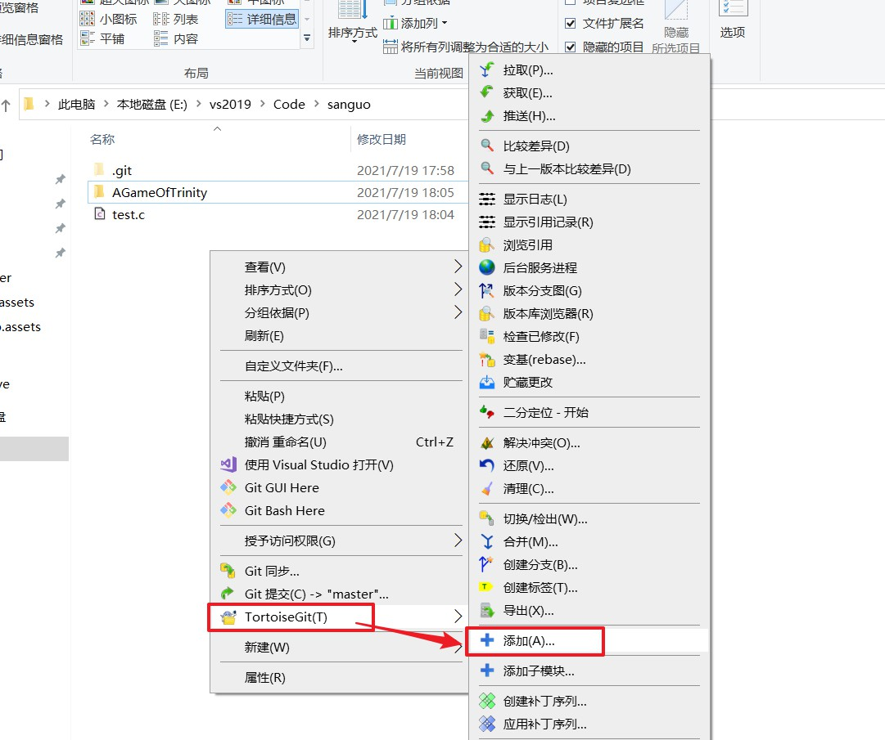
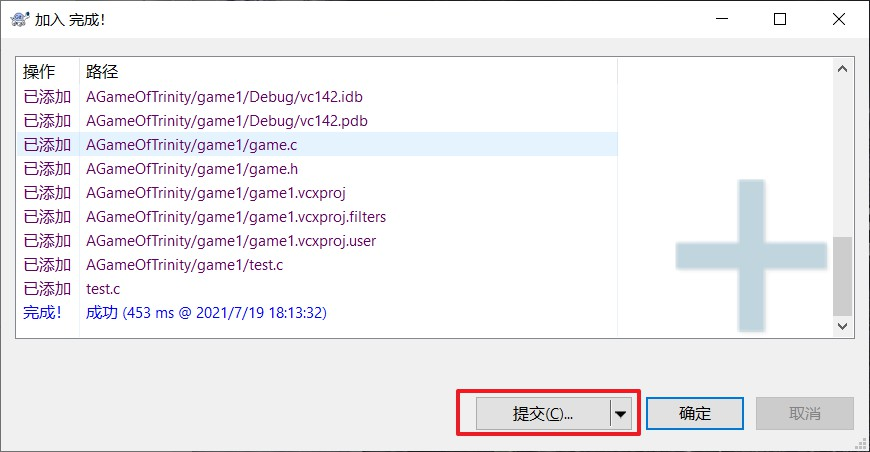

# github

## 1. 创建项目

1. **第一步**： 点击或者 

2. **第二步**：

3. **第三步**：会出现如图所示的界面：

   

## 2. 克隆项目

1. **第一步**：

   

2. **第二步**：

   

3. **第三步：**传输过程。

   

4. **第四步：**显示传输成功界面。

   

## 3. 提交代码

**两种方式（图形结构  VS  命令方式）**

### 图形界面

1. **第一步：**给本地仓库中添加代码。

   

2. **第二步：**预添加代码到本地仓库

   

   

3. **第三步：**提交代码到本地仓库

   

   

   

4. **第四步：**将本地仓库中的代码 推送 到远程仓库。

   

   

   **第一次提交代码会让你输用户名和密码，推送成功的界面如图所示：**

   

5. **第五步：**此时刷新github网页可以看到代码已经托管到网上了。

   

### 命令行的方式

1. **第一步：**打开命令行窗口。**(想在哪个路径下面克隆，就在哪个路径下面点 `Git Bash Here`)**。

   

   

2. **第二步：**克隆远程仓库到本地机器的目录，`git clone 仓库链接`。

   ==直接在命令行输入`git clone https://github.com/wqb-why/test.git`报错，就可将网址最开头的`https`改为`git`，就可正常运行。==

   

3. **第三步：** 
   1. **add**预添加： `git add  xxxx`
   
      
   
   2. **commit**：`git commit -m"测试命令提交"`
   
      
   
   3. **push**将本地代码推送到远程： `git push`
   
      

## 4. 删除项目中的代码

